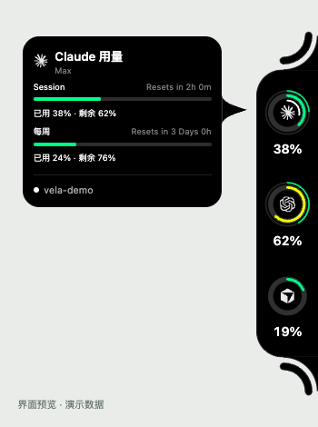
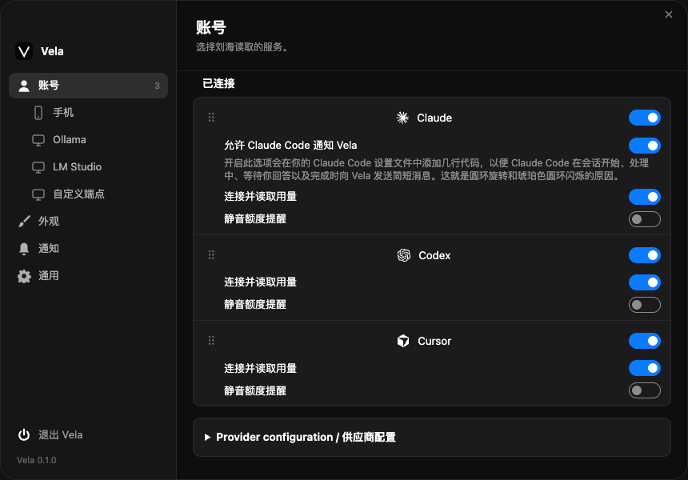

<p align="center">
  
</p>

<h1 align="center">Velo</h1>
<p align="center"><strong>在屏幕边缘，看见 AI 编程的每一刻。</strong></p>
<p align="center">用量、重置时间、运行与等待状态，抬眼即见。</p>

<p align="center">
  <a href="https://github.com/Atingaii/Velo/actions/workflows/ci.yml"></a>
  <a href="LICENSE"></a>
  
  
</p>

<p align="center">
  <a href="#界面预览">界面预览</a> ·
  <a href="#快速开始">快速开始</a> ·
  <a href="#集成与当前状态">集成状态</a> ·
  <a href="#参与贡献">参与贡献</a>
</p>

---

Velo 是面向 **macOS 和 Windows 的 AI 编程桌面伴侣**。它把不同工具的额度和会话状态收进屏幕边缘的一条小面板，让你在终端、编辑器和多个账户之间工作时，少一次切换，少一次等待。

鼠标移到圆环上，可以查看额度窗口、重置时间和会话信息；需要你回应或任务完成时，通过状态变化与提醒及时发现。

> **当前为开发版本。** 核心界面和多项集成已实现，完整功能对齐、双平台原生体验及真实账户验收仍在进行。可下载安装预览版或从源码运行；详细进展见 [功能核对表](docs/migration-parity.md) 和 [兼容性与验收](docs/verification.md)。

## 为什么使用 Velo

- **额度一眼可见**：以圆环展示各工具的用量，悬停查看短期、每周等额度窗口及重置时间。
- **减少无效等待**：区分运行中、等待回应和已完成状态；支持完成、额度阈值与重置提醒，具体覆盖依集成而定。
- **多个账户，各自清楚**：安排账户的显示顺序，分别控制是否采集、是否出现在面板中。
- **适应你的桌面**：选择屏幕边缘、调整尺寸与周额度圆环，配置悬停展开、全屏收起和通知声音。
- **按自己的节奏使用**：可选用量节奏提示和 Claude 每日份额视图，帮助理解周期内的额度消耗。
- **凭据留在系统中**：应用保存的密钥使用系统凭据库；读取第三方 CLI 登录凭据时不改写原凭据。

## 界面预览

以下图片由仓库当前 HTML 界面在浏览器中渲染，**账户、额度和会话均为演示数据**，用于展示布局和操作方式，不代表原生窗口或真实服务验收。头图为 Velo 品牌插画。

### 用量与活动，留在视线边缘

每个工具对应一个圆环。悬停后展开详细额度和活动卡片，工作时保持紧凑。

<p align="center">
  
</p>

### 按你的工作方式安排账户

在一个设置窗口中管理账户显示与排序，并访问外观、提醒和各集成的配置。

<p align="center">
  
</p>

## 集成与当前状态

不同工具提供的数据不同；额度、活动和账户能力以实际来源为准。已接入采集或解析，并不表示全部平台和真实账户已验收。

| 集成 | 当前范围 |
| --- | --- |
| Claude Code、Codex、Cursor、Antigravity、GLM、Grok | 已有用量接入，账户、活动及平台行为继续核对中 |
| MiniMax、Devin、OpenCode、Command Code、GitHub Copilot、Kimi、Kiro、Ollama Cloud、Gemini API | 已移植解析与串行采集，真实账户与异常状态待验收 |
| 自定义 OpenAI 兼容端点 | 已有配置保存、系统凭据库与探测，完整界面行为待核对 |
| 手机连接 | 已实现局域网 v3 加密配对与刷新协议，真实手机互通及快照完整性待验收；默认关闭 |
| 网页登录集成、本地 Ollama / LM Studio 完整指标 | 尚待完成 |

接下来的重点是完成现有能力与 macOS / Windows 实机验收；之后再推进边缘插件机制。文件中转、剪贴板插件及其他扩展目前不作为可用功能提供。

## 快速开始

### 下载安装包

[官网下载](https://velo.codes/#download) · [预览版发布页](https://github.com/Atingaii/Velo/releases/tag/v0.1.0-preview.3)

| 平台 | 安装包 |
| --- | --- |
| macOS · Apple Silicon | [Velo-macos-arm64.dmg](https://github.com/Atingaii/Velo/releases/download/v0.1.0-preview.3/Velo-macos-arm64.dmg) |
| macOS · Intel | [Velo-macos-x64.dmg](https://github.com/Atingaii/Velo/releases/download/v0.1.0-preview.3/Velo-macos-x64.dmg) |
| Windows · x64 | [Velo-windows-x64-setup.exe](https://github.com/Atingaii/Velo/releases/download/v0.1.0-preview.3/Velo-windows-x64-setup.exe) |

macOS 打开 DMG 并将 Velo 拖入「应用程序」；Windows 运行安装向导。预览版 macOS 使用 ad-hoc 签名、尚未公证，Windows 尚未代码签名，首次打开可能需要系统确认。请先阅读 [安装说明](docs/releases/preview.md)，核对 [SHA-256](https://github.com/Atingaii/Velo/releases/download/v0.1.0-preview.3/SHA256SUMS.txt)；不需要关闭系统保护。

发布流程在三个系统 runner 上执行安装后原生 WebView、IPC 和辅助程序检查。真实账户与完整系统体验仍需单独验收。自动更新尚未配置，升级请重新下载。

### 环境准备

| 环境 | 要求 |
| --- | --- |
| 通用 | Git、Node.js 20+、npm、Rust stable |
| macOS | Xcode Command Line Tools；当前打包配置最低为 macOS 12，兼容性仍需实机验证 |
| Windows | Microsoft C++ Build Tools（MSVC）、WebView2 |

系统依赖的具体安装步骤见 [Tauri 官方前置条件](https://v2.tauri.app/start/prerequisites/)。Linux 可用于部分开发检查，目前目标桌面平台为 macOS 和 Windows。

### 从源码运行

```sh
git clone https://github.com/Atingaii/Velo.git
cd Velo
npm ci
npm run dev
```

启动脚本会先构建 `vela-hook`，再启动桌面应用。首次构建需要下载并编译 Rust 依赖。

1. 在你使用的 AI 编程工具中完成登录，再启动 Velo。
2. 从托盘菜单打开设置，在「账户」中选择显示的账户和顺序。
3. 在「外观」中选择位置与显示方式，在「提醒」中按需开启通知。
4. 悬停圆环查看额度与重置时间。某些集成需要额外密钥、客户端或显式启用，请按对应设置操作。

如需 Claude Code 的会话状态，在设置中开启对应消息 / hook 选项；这会向 Claude Code 设置文件添加用于向 Velo 发送状态的配置。

### 构建安装包

```sh
npm run build
```

在目标系统上构建对应安装包，产物位于 `target/release/bundle/`。仓库提供预览安装包；正式发行仍需配置签名、公证及签名更新源。

## 数据与隐私

Velo 在本机保存配置，并按启用的集成读取本地状态或请求相应服务。它仍需要联网查询在线服务的额度。

| 数据 | 存放方式 |
| --- | --- |
| macOS 配置 | `~/Library/Application Support/vela/` |
| Windows 配置 | `%APPDATA%/vela/` |
| 应用保存的密钥 | macOS Keychain / Windows Credential Manager |
| 第三方 CLI 凭据 | 只读访问，不改写原登录凭据 |
| 手机连接 | 默认关闭；手动开启配对窗口后才提供有效配对码 |

提交问题或截图时，请先移除 token、Cookie、密钥、账户信息和真实会话内容。

## 开发与验证

Velo 使用 **Tauri 2 + Rust + HTML / CSS / JavaScript**，共享桌面界面，并在 Rust 层适配原生窗口、托盘、凭据与通知。

```text
src-tauri/src/     Rust 后端与平台集成
src-tauri/ui/      桌面界面
crates/vela-hook/  会话事件辅助程序
scripts/          构建、预览与逻辑检查
tests/ui/         浏览器交互回归
docs/             功能状态、验收与架构决策
```

按顺序运行检查，避免同时启动多个构建进程：

```sh
npm run check:ui
npm test
cargo test --locked --workspace -- --test-threads=1
npx playwright install chromium --only-shell
npm run test:ui
```

Cargo 构建与 Playwright 均限制为单 worker。浏览器测试使用模拟 IPC，不能替代原生窗口、系统权限、真实账户和双平台体验验收。`npm run preview` 可预览 HTML 页面，但没有桌面桥接，不会自动提供演示账户数据。

## 参与贡献

欢迎通过 [Issues](https://github.com/Atingaii/Velo/issues) 提交问题和建议，通过 Pull Request 改进项目。

- **报告问题**：附上系统版本、Velo 提交版本、复现步骤、预期与实际结果；截图或日志请先脱敏。
- **改进代码**：先查阅 [功能核对表](docs/migration-parity.md)，围绕一个明确问题提交改动，并附相应验证结果。
- **调整方向**：涉及新功能或较大设计变更时，先在 Issue 中讨论范围。

开发约定见 [AGENTS.md](AGENTS.md)，工程上下文见 [CONTEXT.md](CONTEXT.md)，重要决策见 [docs/adr](docs/adr/README.md)。

## 许可

本项目采用 [MIT License](LICENSE)。第三方代码、供应商图形及相应版权说明见 [THIRD_PARTY_NOTICES.md](THIRD_PARTY_NOTICES.md)。

## 致谢

Velo 参考并沿用了 [Codenotch](https://github.com/vinzdg/codenotch)项目的设计与部分实现。感谢 Vinz 及其贡献者，相关来源与原始授权已保留。
