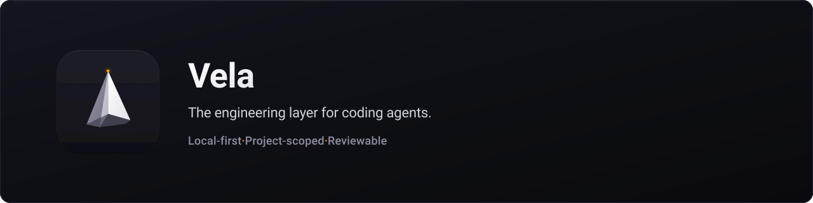
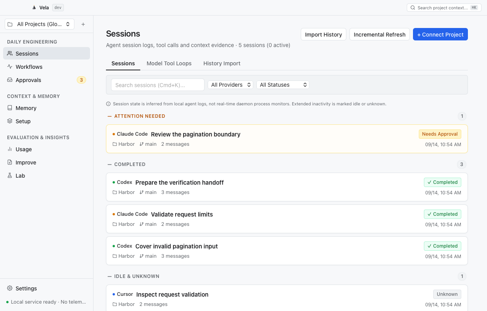

<p align="center">
  
</p>

<h1 align="center">Vela</h1>

<p align="center">
  <strong>An agent session ends. Your engineering context should not.</strong>
</p>

<p align="center">
  <a href="README.zh-CN.md">简体中文</a> ·
  <a href="https://velo.codes">Website</a> ·
  <a href="https://github.com/Atingaii/Vela/releases/tag/v0.1.0-preview.2">Download preview (v0.1.0-preview.2)</a> ·
  <a href="docs/status.md">Status</a> ·
  <a href="docs/architecture.md">Architecture</a> ·
  <a href="CONTRIBUTING.md">Contributing</a>
</p>

<p align="center">
  <a href="https://github.com/Atingaii/Vela/actions/workflows/ci.yml"></a> ·
  <a href="LICENSE">MIT License</a> ·
  <span>macOS 13+ (Apple Silicon)</span>
</p>

<p align="center">
  Vela is a local macOS workspace for supported Claude Code, Codex, Cursor, Pi and OMP session data. It brings conversation evidence, project memory, reviewable workflows and measured Codex comparisons into one place, alongside the agents you already use.
</p>

> **Development branch — acceptance redesign, not yet released.**
>
> The published download remains [0.1.0-preview.2](https://github.com/Atingaii/Vela/releases/tag/v0.1.0-preview.2). The 20-step product scenario and six release gates are **not passed**; see [acceptance](docs/ACCEPTANCE.md), [traceability](docs/TRACEABILITY.md) and the [three-project comparison](docs/reference-comparison.md).
>
> Core paths are implemented, with substantial compatibility and automation limits. This is not a complete implementation of the roadmap or a stable release. The development app is ad-hoc signed, has no Developer ID signature and is not Apple-notarized. Read [feature status and limitations](docs/status.md) before use.

<p align="center">
  
</p>

<p align="center">
  <em>Actual macOS development build with an isolated example project and synthetic session logs. The interface uses the real local helper and database; no personal session data appears here. This workspace redesign is on the development branch and is not included in the preview.2 download.</em>
</p>

## What you can use

- **Observe sessions:** browse normalized messages and supported tool events, inspect project setup, and review token counts reported by local logs. Inferred states and incomplete history are labeled.
- **Keep useful context:** save memories with provenance and explicit scope, recall active memories within a conservative budget, and export checkpoints containing user notes and a captured Git state.
- **Review before running:** edit Markdown workflows, dry-run supported reads, approve frozen actions and inspect persisted run records. Project tests and agent commands require approval. New development requests have a [configurable seven-day expiry](docs/implementation/approval-expiry-contract.md).
- **Compare actual outcomes:** inspect deterministic correction-based suggestions, preview and safely apply or undo supported file changes, and run baseline/candidate commands in separate Git worktrees at the same commit.
- **Record human feedback:** assess completed runs with a reason, inspect prior revisions, and reopen persisted feedback without changing objective execution results.
- **Control Lab memory:** independently select Recall OFF, strict Memory OFF or an explicit project recall for each variant; review the frozen selection before approval.
- **Own reference material:** import text, HTML, text-based PDF, DOC/DOCX, ODT, RTF or an explicit document URL. Edit, export, archive, restore or explicitly refresh sources with version history. Library imports default to private; paragraph search and reviewed Ask use eligible public sources.

Sessions, Memory and Workflows are directly accessible from the sidebar. Project configuration, observed usage, Improve and Lab remain available alongside global Search, Inbox and Settings. Keyboard shortcuts are discoverable in menus and tooltips.

Notifications are optional and off by default. When enabled, Vela groups new approval, completion and error events, links back to the relevant project, and uses three short original sounds. Sound previews are available in Settings. The current ad-hoc build was refused OS notification authorization on the verification host; banner delivery remains unverified. See [verification](docs/verification.md#explicit-environment-limitation).

## Install

Get the Apple Silicon archive and `SHA256SUMS` from the [0.1.0-preview.2 release page](https://github.com/Atingaii/Vela/releases/tag/v0.1.0-preview.2), verify the checksum, then move `Vela.app` into Applications. Minimum supported system: **macOS 13**. Intel builds are not part of this preview.

The development archive is **ad-hoc signed and not notarized**. macOS may require its per-application “Open Anyway” flow after you inspect the source and release. Do not disable Gatekeeper globally. Preview storage formats may change; keep your own backup of important Vela data.

## Build and run

Requirements: an Apple Silicon Mac, Git, and Xcode Command Line Tools with **Swift 5.9+**. The GUI SwiftPM product is `VelaDesktop`; the CLI is `vela`; the packaged application is `Vela.app`.

```sh
git clone https://github.com/Atingaii/Vela.git
cd Vela
swift build
swift run VelaDesktop
```

To package the local application, Python 3 is also required:

```sh
bash scripts/package-macos.sh
open releases/Vela.app
```

The package script limits build concurrency to two jobs by default (`VELA_BUILD_JOBS` overrides it) and defaults to the `dev` channel and produces `releases/Vela-macOS-arm64.zip` and `releases/SHA256SUMS`. Setting a channel does not sign, notarize or publish a release. The installed application uses Swift, AppKit, the system WKWebView, SQLite and other macOS frameworks; it does not require Electron, Node.js or a Python runtime.

## First project and CLI

The development client supports Simplified Chinese and English. Choose **Settings → Language** or **Vela → Language** in the macOS menu. The choice is stored locally; switching preserves open drafts and leaves your project content in its original language. This feature is not included in the preview.2 download.

Add a project directory in the desktop, then inspect Sessions and Setup. Registering a project does not approve executing its scripts. Initial discovery reads a bounded set of recent agent logs; it does not import your entire history.

```sh
swift run vela doctor
swift run vela call projects.add '{"path":"/absolute/path/to/project"}'
swift run vela refresh
swift run vela search 'verification'
swift run vela recall 'project constraints' --project /absolute/path/to/project
```

Use `VELA_HOME` or `--home /absolute/path/to/store` to select a store. The standalone CLI defaults to `~/.vela`. Packaged desktop channels use separate stores; point the CLI and MCP at the desktop store you want to use.

## Local backup

The development CLI can create a complete local Store bundle and restore it into a new directory. It preserves private/public assets, History and managed outputs while revoking old execution requests. The bundle is unencrypted and excludes external agent credentials, original log directories and project working trees. See the [backup and restore guide](docs/implementation/local-store-backup-contract.md) for commands, limits and index rebuilding. This is separate from portable Memory interchange and remote recovery.

## MCP

Add a stdio MCP server to your agent configuration using the installed helper and your desktop store:

```json
{
  "mcpServers": {
    "vela": {
      "command": "/Applications/Vela.app/Contents/MacOS/vela",
      "args": ["mcp", "--home", "/absolute/path/to/.vela-dev"]
    }
  }
}
```

Read tools expose supported search, recall and context records. Requests require an explicitly selected, registered project. The optional `--contribute` flag also permits candidate memories, checkpoints, session-backed signals and suggestion drafts. Contribution cannot activate an existing memory, apply a suggestion or execute a workflow. Private Library material is excluded from agent retrieval.

## From evidence to reuse

Explicit engineering corrections can create source-linked candidate Memory and reviewable suggestions. Repeated supported tool sequences can propose disabled Workflow drafts. Open the exact source message before choosing what to test.

In Lab, select a committed project, an explicit Codex executable and model, the same task, protected verification files and allowed output files. Review the frozen request in Inbox before running it. A comparison can legitimately be **inconclusive**. Promotion activates only unchanged, tested project Memory after an eligible comparison and explicit review.

To offer active Memory to later Codex sessions, preview and apply the project-only `.codex/hooks.json` change, then review and trust the exact hook in Codex `/hooks`. Vela does not bypass provider trust. Recall receipts establish that context was offered; they do not establish agent compliance or improvement. See the [Lab and Reuse contract](docs/implementation/agent-lab-contract.md).

## Know the preview boundaries

- Initial ingestion selects up to **60 recent source files per provider**, using a **256 KB tail** plus a **32 KB header** where needed. The development branch adds explicit, resumable historical import for Claude/Codex/Pi/OMP JSONL, with paged original records kept outside the dashboard. Cursor history, the history interface and native session transfer remain incomplete; see the [history contract](docs/implementation/session-history-contract.md).
- **Usage is observed log usage.** The development branch separately reads actual Codex account quota through its read-only app-server protocol; other provider quota, pricing and the `usage_reset` trigger remain incomplete.
- The development branch adds **reviewed model proposals**, three-stage Improve and **bounded multi-turn tool loops**. Core executes selected reads and feeds actual results into later model turns; external actions receive separate approvals. The supported catalog, call/time limits and unverified external integrations remain explicit.
- The development branch **passes selected Guidelines, active Memory and captured inputs into an explicitly configured Agent prompt argument**. Existing raw commands are preserved. A recorded prompt does not prove model compliance.
- Lab supports paired commands and an explicit **Codex agent mode**: frozen task/model request, isolated worktrees, protected verification files, and a separate verifier. Three complete repetitions per variant are required for promotion review. Ties, missing measurements and regressions cannot promote a candidate. The first six real runs were tied; [the evidence](docs/evidence/2026-09-13-agent-lab.json) preserves a corrected scorer defect. Future correction reduction remains unmeasured.
- The development branch has an **explicitly managed launchd user service**, timezone-aware cron and bounded skip/latest/all catch-up. Pending approvals and uncertain outcomes prevent overlapping runs. The public preview.2 package does not contain these additions.

See [the detailed status](docs/status.md) and the [228-item reference coverage inventory](docs/parity/README.md). Full coverage is the target; it has not been declared achieved. Local semantic recall, portable archives, installable SDKs, workflow composition and optional external adapters are also being integrated and verified on this branch.

## Optional integrations

The development repository includes installable [TypeScript](sdk/typescript) and [Python](sdk/python) SDKs for an explicitly selected local helper and store. The optional [Walrus adapter](sdk/walrus) uses the pinned official MemWal SDK, and the [OpenClaw plugin](sdk/openclaw) provides agent-scoped recall and candidate capture through the host's public API. These packages are built with `npm pack` or a Python wheel; they are not yet published to package registries. Their separate Node/Python dependencies are not bundled into the default Mac app.

Remote account ownership, encrypted storage/recovery and delegate revocation require separate account-level verification. Local package tests, host hook execution and public service health do not establish a successful remote write. See [the remote contract](docs/implementation/walrus-remote-contract.md).

## Validate a checkout

A complete Xcode installation supplies XCTest:

```sh
swift test
```

On a Command Line Tools-only system, build first and use the portable runner:

```sh
swift build
python3 scripts/test-portable.py
python3 scripts/test-rpc.py
python3 scripts/check-repository.py
```

The portable runner compiles the real core with the same synchronous test bodies and a small assertion compatibility layer. It is **not XCTest**. RPC/MCP tests exercise the compiled CLI with disposable stores. Repository checks require Node.js to validate JavaScript; development tools are not bundled with the app.

For reproducible real-CLI browser interaction checks and synthetic screenshot fixtures, see [Interface checks](CONTRIBUTING.md#interface-checks). Native macOS controls and notifications require a separate app check.

## Data and architecture

Session indexes and run records live in SQLite WAL. Memory, workflow, guideline, library and checkpoint assets also live in readable Markdown under the selected store's `assets/` directory. Local Vela use has no account requirement or enabled telemetry. Optional Composio and Walrus integrations have separate explicit account, network and credential boundaries; they are not enabled by opening the app.

An explicitly imported URL makes a network request. An approved agent command may send the supplied context to its provider. Vela does not automatically submit session history to a model.

The AppKit/WKWebView interface communicates with a separate `vela` helper through restricted JSONL RPC. FSEvents drives incremental ingestion. The website is static HTML, CSS and JavaScript. See [architecture](docs/architecture.md) and [ADR 0001](docs/adr/0001-native-macos-core.md). Performance targets are not presented as measured guarantees.

Executed checks and initial resource/search measurements are recorded in [verification](docs/verification.md).

## Contributing and license

Start with a reproducible problem or a focused improvement. Read [CONTRIBUTING.md](CONTRIBUTING.md), [SECURITY.md](SECURITY.md) and the [Code of Conduct](CODE_OF_CONDUCT.md).

Product direction was informed by user-provided Blume analysis, Walrus Memory/MemWal context-ownership ideas and [px0](https://px0.ai/) workflow design. Vela is an independent implementation, unaffiliated with those projects or agent providers. Their private source, prompts and brand assets are not bundled. The initial desktop and website interfaces were authored through the requested Antigravity CLI Gemini 3.8 Flash (High) workflow.

[MIT License](LICENSE) © Vela contributors.
