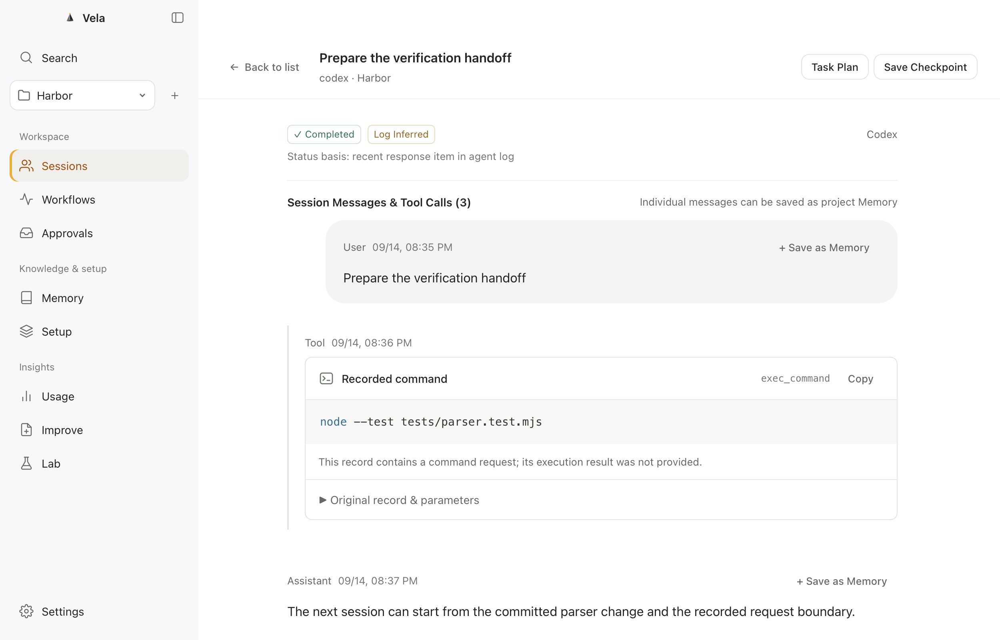

<p align="center">
  
</p>

<h1 align="center">Vela</h1>

<p align="center">
  <strong>让一次 Agent Session 结束，但工程经验不结束。</strong>
</p>

<p align="center">
  <a href="README.md">English</a> ·
  <a href="https://velo.codes">官方网站</a> ·
  <a href="https://github.com/Atingaii/Vela/releases/tag/v0.1.0-preview.2">下载预览版 (v0.1.0-preview.2)</a> ·
  <a href="docs/status.md">功能状态</a> ·
  <a href="docs/architecture.md">系统架构</a> ·
  <a href="CONTRIBUTING.md">贡献指南</a>
</p>

<p align="center">
  <a href="https://github.com/Atingaii/Vela/actions/workflows/ci.yml"></a> ·
  <a href="LICENSE">MIT 许可证</a> ·
  <span>macOS 13+ (Apple Silicon)</span>
</p>

<p align="center">
  Vela 是 macOS 上的本地工程工作台，整理受支持的 Claude Code、Codex、Cursor、Pi 和 OMP 会话数据，将对话证据、项目 Memory、可审批的 Workflow 和真实 Codex 对照记录放在一起，配合已有 Coding Agent 使用。
</p>

> **当前开发分支：验收与界面重构，尚未发布。**
>
> 下载链接仍指向 [0.1.0-preview.2](https://github.com/Atingaii/Vela/releases/tag/v0.1.0-preview.2)。20 步产品场景和六项发布门槛**尚未通过**；请阅读[验收框架](docs/ACCEPTANCE.md)、[需求追踪](docs/TRACEABILITY.md)和[三个参考项目对照](docs/reference-comparison.md)。
>
> 核心路径已经实现，但适配、自动化和评测仍有明确限制；当前版本不代表完整产品路线图已经交付，也不是稳定版本。开发包使用 ad-hoc 签名，没有 Developer ID 签名，尚未通过 Apple 公证。使用前请阅读[功能状态与限制](docs/status.md)。

<p align="center">
  
</p>

<p align="center">
  <em>当前 macOS 开发版实图：原生 WKWebView 连接真实 Swift helper 与合成项目。展示可读命令、按任务区分的图标、条目菜单与独立账户额度；此界面尚未包含在 preview.2 下载中。</em>
</p>

## 当前可用能力

- **观察会话**：查看统一的消息和受支持工具事件、扫描项目 Setup、汇总本地日志报告的 token。状态推断与不完整历史明确标记。
- **保留上下文**：保存带来源和作用域的 Memory，以保守预算召回 Active 内容，导出包含用户记录和真实 Git 快照的 Checkpoint。
- **审阅后执行**：编辑 Markdown Workflow，Dry Run 支持的只读工具，审批冻结的动作快照，查看持久化运行记录。项目测试和 Agent 命令需要审批。开发版新请求默认[七天有效，可配置](docs/implementation/approval-expiry-contract.md)。
- **比较实际结果**：检查确定性规则提取的纠错建议，预览并安全应用/撤销受支持的文件变更，在同一 Git 提交的独立 worktree 中运行 baseline/candidate 命令。
- **管理资料**：导入文本、HTML、可提取文字的 PDF、DOC/DOCX、ODT、RTF 或明确指定的文档 URL；编辑、导出、归档、恢复或显式更新来源，并保留版本。Library 默认私有；段落检索与经审批的 Ask 仅使用合格公开来源。

会话、记忆与工作流可从侧栏直接进入。项目配置、日志用量、改进和 Lab 保留各自入口，搜索、审批收件箱与设置作为全局功能。快捷键可在菜单与悬停提示中发现。

通知默认关闭。启用后，Vela 会合并新的审批、完成与失败事件，点击可返回对应项目，并使用三种简短的原创提示音；设置中可单独试听。 当前 ad-hoc 包在验收机器上被 macOS 拒绝通知授权，系统横幅投递尚未通过验收，详见[验收边界](docs/verification.md#explicit-environment-limitation)。

运行记录现在支持带理由的人工评估、历史修订和重启后读取；评估不会改变客观执行结果。Lab 可独立设置两侧的自动召回、关闭召回或严格禁用 Memory，并在审批前查看冻结选择。

## 安装

在 [0.1.0-preview.2 发布页](https://github.com/Atingaii/Vela/releases/tag/v0.1.0-preview.2)下载 Apple Silicon 压缩包和 `SHA256SUMS`，核对校验值后，将 `Vela.app` 移入 Applications。最低系统要求为 **macOS 13**；本预览版不提供 Intel 构建。

开发包为 **ad-hoc 签名、未公证**应用。审阅源码与发布说明后，macOS 可能要求通过针对单个应用的“仍要打开”流程放行；不要关闭全局 Gatekeeper。预览期间存储格式可能调整，请自行备份重要的 Vela 数据。

## 从源码构建

需要 Apple Silicon Mac、Git，以及提供 **Swift 5.9+** 的 Xcode Command Line Tools。GUI 的 SwiftPM 产品名是 `VelaDesktop`，CLI 是 `vela`，打包后的应用名是 `Vela.app`。

```sh
git clone https://github.com/Atingaii/Vela.git
cd Vela
swift build
swift run VelaDesktop
```

打包本地应用还需要 Python 3：

```sh
bash scripts/package-macos.sh
open releases/Vela.app
```

打包脚本默认使用 `dev` 通道，输出 `releases/Vela-macOS-arm64.zip` 和 `releases/SHA256SUMS`。设置通道本身不会完成 Developer ID 签名、公证或公开发布。安装后的应用使用 Swift、AppKit、系统 WKWebView、SQLite 等 macOS 框架，不依赖 Electron、Node.js 或 Python 运行时。

## 添加项目与使用 CLI

开发版支持简体中文和 English。在 **设置 → 语言** 或 macOS 菜单 **Vela → 语言** 中切换，选择保存在本地。切换时保留未保存草稿，项目内容保持原文；preview.2 下载暂不包含此功能。

在客户端添加项目目录后，查看 Sessions 和 Setup。登记项目不等于批准运行项目脚本。首次发现只读取有数量与窗口限制的近期日志，不会导入全部历史。

```sh
swift run vela doctor
swift run vela call projects.add '{"path":"/absolute/path/to/project"}'
swift run vela refresh
swift run vela search 'verification'
swift run vela recall '项目约束' --project /absolute/path/to/project
```

通过 `VELA_HOME` 或 `--home /absolute/path/to/store` 选择数据目录。独立 CLI 默认使用 `~/.vela`；打包桌面应用的不同通道使用独立目录。让 CLI 和 MCP 指向你实际使用的桌面数据目录。

## 本地备份

开发版 CLI 可以备份完整本地 Store，并恢复到新目录，保留私有/公开资产、History 原文和受管交付文件，同时撤销旧请求的执行资格。bundle 未加密，不包含外部 Agent 凭证、原始日志目录或项目工作树。命令、容量限制与索引重建见[备份与恢复说明](docs/implementation/local-store-backup-contract.md)。此功能独立于受限 Memory interchange 和远端恢复。

## MCP 接入

在 Agent 配置中添加 stdio MCP 服务，指定安装后的 helper 和桌面数据目录：

```json
{
  "mcpServers": {
    "vela": {
      "command": "/Applications/Vela.app/Contents/MacOS/vela",
      "args": ["mcp", "--home", "/absolute/path/to/.vela-dev"]
    }
  }
}
```

只读工具提供受支持的 Search、Recall 和上下文记录，请求必须显式指定已登记的目标项目。增加 `--contribute` 后，可创建候选 Memory、Checkpoint、绑定真实会话的 Signal 及 Suggestion Draft；不能激活已有 Memory、应用建议或执行 Workflow。私有 Library 不会通过 Agent 检索返回。

## 从证据到后续使用

明确的工程纠错可以形成带原消息来源的 Candidate Memory 和可审阅建议。多次出现的受支持工具序列可以形成默认停用的 Workflow 草案。先查看确切来源，再决定候选内容与验证方式。

在 Lab 选择已提交的项目、明确的 Codex 程序与模型、同一任务、受保护的验证文件和允许产出的文件；在 Inbox 审核冻结内容后执行。结果可以是“证据不足”。只有满足比较门槛且再次人工审阅，才会激活内容未变的受测项目 Memory。

要向后续 Codex 会话提供 Active Memory，先预览并应用项目内 `.codex/hooks.json` 变更，再在 Codex `/hooks` 审核并信任确切定义。Vela 不绕过 provider 信任。召回收据仅证明上下文已提供，不证明 Agent 采纳或行为改善。详见 [Lab 与 Reuse 接口](docs/implementation/agent-lab-contract.md)。

## 预览版的重要边界

- 初始摄取最多选择**每个 provider 60 个近期来源文件**，按需读取 **256 KB 尾窗和 32 KB 文件头**。开发分支新增 Claude/Codex/Pi/OMP JSONL 的显式历史回填、断点恢复与原始记录分页，完整记录不直接装入 dashboard。Cursor 历史、历史界面和原生 Session 迁移仍需继续实现，详见[历史接口合同](docs/implementation/session-history-contract.md)。
- **Usage 是已观察到的日志用量**。开发分支另有通过只读 app-server 协议取得的真实 Codex 账户额度；其他 provider 额度、定价和 `usage_reset` 仍未完成，不能从日志 token 推算。
- 开发分支新增**经审批的模型提案、三阶段 Improve 和有界多轮工具循环**。Core 执行选定的只读工具，将实际结果送入后续模型轮次；外部动作另行审批。工具目录、调用/时间上限与尚未实测的外部集成都有明确边界。
- 开发分支会将选定 Guideline、Active Memory 和实际输入**交给显式配置的 Agent 提示词参数**。旧 raw argv 保留；已提供上下文不等于模型已遵守。
- Lab 支持命令对照及明确的 **Codex Agent 模式**：冻结任务和模型请求、隔离 worktree、保护验证文件、另建干净目录验证。晋升审阅至少需要两边各三次完整样本；同分、缺失指标或退步不能晋升。首轮六次真实任务为同分，[公开证据](docs/evidence/2026-09-13-agent-lab.json)保留计分器缺陷及更正记录；未来纠错率下降仍未测量。
- 开发分支有**显式管理的 launchd 用户服务**、时区 cron 和有界 skip/latest/all 补跑；待审批及未知结果阻止同工作流重叠。这些新增行为不在公开 preview.2 包中。

完整边界见[功能状态](docs/status.md)和[228 项参考能力台账](docs/parity/README.md)。目标是完整覆盖，当前尚未宣称达成。本地语义召回、可移植归档、可安装 SDK、工作流组合及可选外部后端也在本分支接通和验证。

## 可选集成

开发仓库提供可安装的 [TypeScript](sdk/typescript) 和 [Python](sdk/python) SDK，使用明确选择的本地 helper 与 store。[Walrus 适配器](sdk/walrus)使用固定版本官方 MemWal SDK；[OpenClaw 插件](sdk/openclaw)通过公开宿主接口提供按 agent 隔离的召回与候选捕获。包通过 `npm pack` 或 Python wheel 构建，尚未发布到包注册服务；这些 Node/Python 依赖不进入默认 Mac 程序。

远端账户所有权、加密写入/恢复和委托撤销仍需独立账户级验证。本地安装测试、宿主 hook 执行和公开服务健康不能代替远端写成功，详见[远端合同](docs/implementation/walrus-remote-contract.md)。

## 验证源码

完整 Xcode 安装提供 XCTest：

```sh
swift test
```

仅安装 Command Line Tools 时，先构建，再使用 portable runner：

```sh
swift build
python3 scripts/test-portable.py
python3 scripts/test-rpc.py
python3 scripts/check-repository.py
```

Portable runner 将真实核心与原有同步测试方法一起编译，仅提供小型断言兼容层，**不等同于 XCTest**。RPC/MCP 黑盒测试会调用已编译的 CLI，并使用一次性数据目录。仓库检查需要 Node.js 校验 JavaScript；这些开发工具不进入安装包。

真实 CLI 驱动的浏览器交互测试与合成截图 fixture 见[界面验证说明](CONTRIBUTING.md#interface-checks)。macOS 原生控件、声音和系统通知仍需单独验证。

## 数据与架构

会话索引和运行记录保存在本地 SQLite WAL。Memory、Workflow、Guideline、Library 和 Checkpoint 同时保存为数据目录 `assets/` 下的可读 Markdown。本地 Vela 无需云账户，不启用遥测。可选 Composio/Walrus 接入各有明确的账户、网络与凭据边界，不会因打开应用而启用。

明确导入 URL 会发起网络请求；获批的 Agent 命令可能向对应 provider 发送指定上下文。Vela 不会自动把会话历史提交给外部模型。

AppKit/WKWebView 界面通过受限 JSONL RPC 与独立 `vela` helper 通信，使用 FSEvents 驱动增量摄取。官网采用静态 HTML、CSS 和 JavaScript。技术说明见[架构文档](docs/architecture.md)与 [ADR 0001](docs/adr/0001-native-macos-core.md)；性能目标不会作为已测量的保证。

已执行的验证和初步内存、搜索延迟测量见[验收记录](docs/verification.md)。

## 贡献与许可证

欢迎提交可复现的问题和范围明确的改进。请阅读[贡献指南](CONTRIBUTING.md)、[安全报告流程](SECURITY.md)与[行为准则](CODE_OF_CONDUCT.md)。

产品方向参考了用户提供的 Blume 分析、Walrus Memory/MemWal 的上下文所有权思想和 [px0](https://px0.ai/) 工作流设计。Vela 是独立实现，与参考项目及 Agent 厂商无隶属关系；不包含它们的私有源码、提示词或品牌素材。初始桌面与官网界面通过指定的 Antigravity CLI Gemini 3.8 Flash（High）工作流实现。

[MIT 许可证](LICENSE) © Vela contributors。
