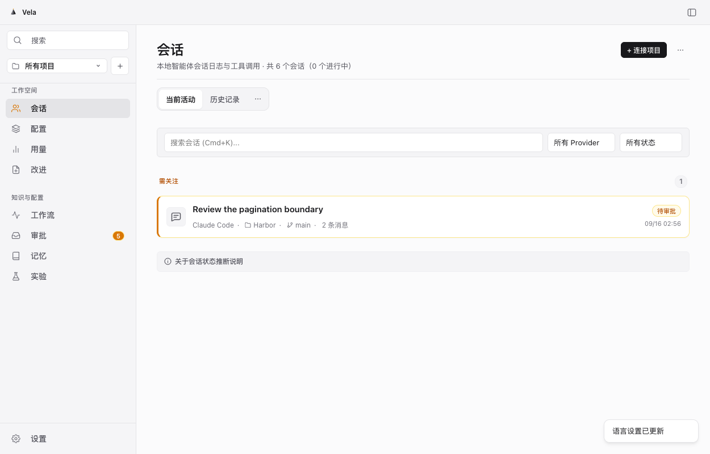
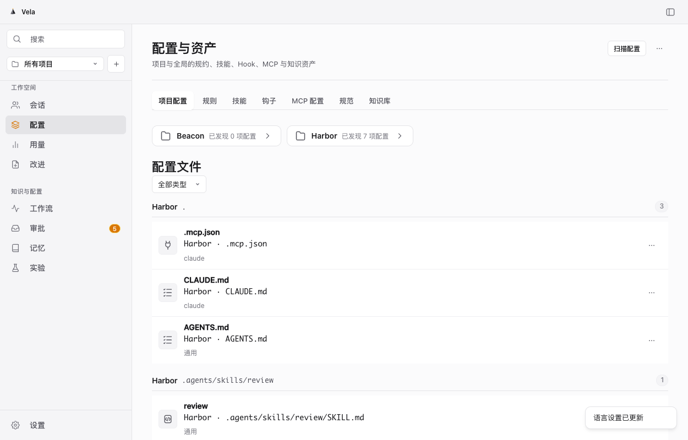
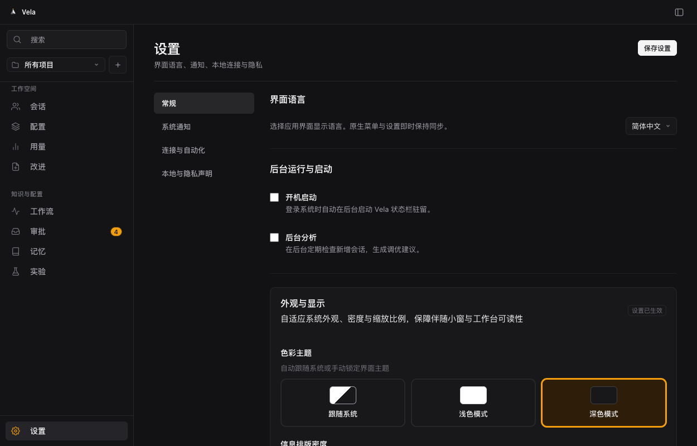
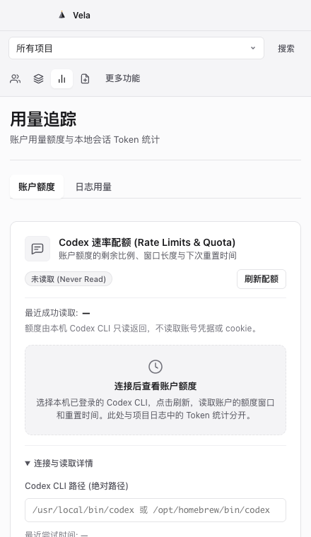

# 2026-09-16 Blume 原生跟进与 Vela 窗口/偏好状态

本文记录有限的 Blume 观察，以及 Vela 本轮源码和浏览器验证状态。它不表示功能或交互等价，也不表示 Vela 原生验收已通过。

## 本轮摘要

- Blume 参考观察覆盖窄窗 Agents、Settings 分组、Appearance 的 90/100/110/125/150 缩放、Theme 切换、Pin→浮条→Expand→Unpin、Session 标签、Project/Setup 栏目和 Markdown artifact 阅读。
- Vela 主窗关闭隐藏、Dock/状态栏重新打开、浮条展开和 frame fitting 均有源码路径；多显示器热插拔、重启后 frame/pin 状态、Cmd-W 各状态焦点/路由保留仍需原生复测。
- 当前 CUA 已明确 Mac 处于锁屏，不能把源码或浏览器结果写成原生成功。

## Blume 已观察与未验证边界

已观察：重新打开后可访问 Agents、Settings、Setup、Usage；Settings 有 Personalization、Intelligence、App 分组；Appearance 的缩放、状态分组与 Regular/Compact 控制分别可见；Forget-me-not 与 Bluebell 间实际切换并恢复；Pin 最终恢复为普通带 traffic lights 的窗口。Session 显示 metadata、related chips 与 Recent activity/Todos/Sub-agents；Project 显示 Setup/Conversations/Worktrees，并报告 scan limit 1000。

未验证：Pin 过程中一次 AX 点击跳到 session，不能证明 Usage 路由保留；Usage 只有连接/中止错误，未得到成功 quota；Edit block 未确认进入编辑器或保存；非空 Improve、plan、sub-agent、worktree 图、账户、设备、同步、更新、MCP 安装、PTY 与跨 harness transfer 均未建立成功证据。未复制私有源码、提示词、品牌资产或用户记录。

## Vela 本轮状态

### 已实现，仍有验证范围

- Host 为每个 helper 请求记录偏好 epoch；成功 `settings.save` 推进 epoch，过时的 init/dashboard 回包不再同步 locale/theme/notification，而 dashboard 的项目和计数更新仍继续。实现见 [`main.swift`](../../Sources/VelaApp/main.swift)。超时、stdin 失败、helper 终止与溢出重启均清理 pending epoch。host-local 乱序栅栏仅完成源码审查与编译；浏览器 held stale-dashboard 场景覆盖的是 renderer 栅栏，不能证明 host 或跨进程行为。
- `handleSettingsSave` 已去除在 helper 确认前写入原生通知 policy 的路径；通知状态仅应由确认回包同步。`swift build --jobs 2` 已通过，但原生的失败保存/通知投递尚未实测。
- renderer 的 appearance、locale 与通用 Settings 保存现在共用 `settingsSaveQueue`；每项只接纳真实 `settings.save` 的完整 confirmed 回包，appearance 不再额外 reconcile `settings.get`。冻结 UI 的浏览器 `appearance-r5` 完整 9 项已通过，包括 rapid queue、failed-transport rollback、held stale-dashboard 不回退、跨 mount 的 density/zoom 持久化、未保存 notification draft 保留和单并发断言。

### 本轮发现与修复

`appearance-r2b` 发现未保存 notification draft 在离开再进入 Settings 时丢失；原因是导航路径清空 `state.settingsDraft`。移除后，独立 `appearance-r3` 与 `appearance-r5` 完整回归通过。早期失败收据保留。

菜单测试曾错误地测量 details 容器，并误用 Playwright boundingBox 字段。改为实际 popup 的 x/y/width/height、点击可达性和键盘首尾操作后复现失败。Gemini 修复固定定位坐标合同；等待真实 toggle 定位完成后，`design-r5b/r5c` 的 16 项通过。不能用原 r4 的误绿结果证明菜单正确。

登录项操作改为只在 helper 成功保存后执行一次。系统操作失败会明确说明“偏好已保存，但登录项未更新”，不自动补偿写入或重试；系统与存储不具备跨系统原子事务。该宿主分支已编译，原生系统成功/失败路径未实测。

## 仍需原生检查

- 解锁后检查 Cmd-W、Dock reopen、状态栏 Show 在 workspace、companion、expanded-pinned、collapsed bar 下的焦点、路由、helper 生命周期与 panel 数量。
- 在不同缩放的两块显示器及显示器断开后检查 Pin/Expand/Unpin frame；当前 frame 仅在进程内保存，重启恢复策略也未验证。
- 检查 `system`、`light`、`dark` 在主窗和浮条同时存在时的一致性，并覆盖保存失败。

52 项 Blume 审计仍未关闭。

## 最终本轮源码与本机验证

[机器收据](../evidence/2026-09-16-blume-refinement.json)保存最终源码、开发包、截图哈希与每项测试名称。`r7` 是本轮最终冻结 renderer，和本机开发包、待验收原生 QA 包的七个主要 UI 文件逐字一致。

| 验证 | 结果与范围 |
| --- | --- |
| 外观设置 | 9 项通过；主题、密度、缩放、真实保存/失败回滚、旧读取、跨页面草稿 |
| 应用框架 | 7 项通过；双语、工作区/窄布局、活动/历史、详情标签、项目与文档关联 |
| 配置编辑 | 13 项通过；完整原文、预览、冻结审批、精确写入、Undo、来源变化和异步竞态 |
| 设计检查 | 16 项通过；九个页面、长标题/两行摘要、实际菜单边界和点击、Enter/Space/方向键/Escape、安全代码渲染与精确复制 |
| 额度状态 | 7 种状态通过；未读取、0/100 使用量、缺失窗口/重置时间、过期、失败后保留历史；包含 440px 浅色与深色 150% 缩放 |
| Core/打包 | 包内真实 helper 的 RPC/MCP 与外观持久化通过；配置编辑 RPC 14 项、portable Core 7 方法、原生 fixture 边界 3 项通过；资源白名单和签名完整性通过 |

`r6` 的完整操作序列发现了菜单在列表底部首次打开即关闭的问题：记录到 click 后的容器 scroll 先于 details toggle，异步定位尚未发生。Terra 将 summary 激活改为同步打开和定位，保留外部滚动关闭、单菜单互斥与键盘行为；`r7` 复验通过。此前失败和测试修正记录保留，未用重复运行覆盖失败证据。

额度测试使用合成 Codex app-server 与真实 Vela helper，不访问用户账户，不能证明真实订阅或其他 provider 兼容。当前系统仅有 Command Line Tools，portable runner **不是 XCTest**。本轮本机开发包为 Apple Silicon、ad-hoc 签名，未公证；公开 preview.2 下载没有更新。Mac 锁屏仍阻断最终原生生命周期和系统副作用验收。

本轮实际浏览器截图（合成数据，不冒充原生截图）：

| 会话工作区 | 项目配置 |
| --- | --- |
|  |  |

| 深色外观设置 | 窄窗额度连接 |
| --- | --- |
|  |  |

### English

The final frozen renderer passed 45 checks across appearance, navigation, reviewed setup editing and design, plus seven synthetic quota states. Gemini 3.8 Flash High authored the UI; Terra implemented foundation logic; the primary model reviewed and tested locally. Screenshots use synthetic data and a real helper in a browser, not native window captures. The local development package is ad-hoc signed and not notarized. Native window lifecycle and system side effects remain unverified because the Mac is locked; complete Blume parity and a stable release are not claimed.

本轮清理 15 个明确创建的临时目标，合计 87,371,415 logical bytes；测试服务、旧 QA 和指定 Antigravity 会话均已停止，临时 CLI 文件访问授权已移除。保留开发包、测试收据、最终隔离原生 QA 与预存依赖，便于解锁后继续验收。
