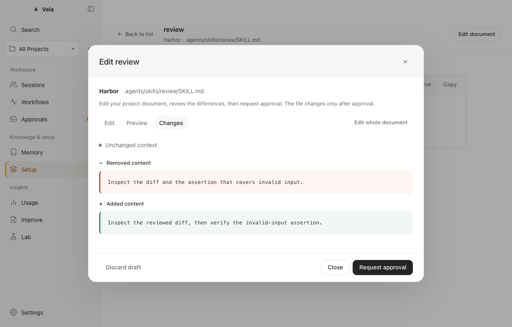

# Setup 编辑指南 / Setup Editing Guide

*实际 renderer 与 Swift helper 的浏览器测试截图，使用合成项目 Harbor；不是新原生流程的验收截图。 / Actual renderer and Swift helper browser test with synthetic Harbor data; not native acceptance evidence.*

## 中文

在 **Setup** 中选择一个项目内的 Markdown 指令或 Skill，打开详情后点击 **编辑（Edit）**。编辑器可以修改全文，也可以按块编辑；两种方式最终都生成同一份完整 Markdown 内容。关闭编辑弹窗只会保留本窗口当前的草稿；macOS 关闭窗口只是隐藏同一窗口，草稿仍会保留。退出应用或窗口内容重新载入时草稿会丢弃，文件不会因此改变。

在 **编辑（Edit）** 中完成草稿后，可切换到 **预览（Preview）** 查看修改后的全文。打开 **差异（Changes）** 或点击 **检查修改（Review changes）**，都会让 helper 重新读取当前文件，取得新鲜的原文与草稿并展示完整差异。检查成功后，底部操作变为 **提交审批（Request approval）**，点击才会建立一次性审批请求。导航中的 **审批（Approvals）** 显示冻结的目标、原文、修改后内容和差异；批准才会写入文件。写入后，详情中的 **Changes** 显示记录，并可对同一已审阅变更使用 **Undo**。Undo 会检查文件仍是该次写入后的版本；外部修改过文件时会拒绝覆盖，需人工重新检查。

Setup 的扫描历史与编辑读取的当前原文是两条不同路径。扫描历史用于观察、差异和版本记录；打开编辑器、检查修改和批准执行前都会重新安全读取当前文件并检查 hash、文件身份、项目根和父目录身份。因此在打开编辑器后有外部改动、替换文件或路径变化时，不能继续使用旧预览，需重新打开并检查当前内容。

空 Markdown 文档是合法的编辑结果。只有项目内、已识别的 `instruction` 或 `skill` Markdown 可以进入此流程。全局文件、已脱敏内容、withheld 内容、非 Markdown 配置或规则、未知/失效 artifact、链接或硬链接、非 UTF-8、超过大小限制的文件都不可编辑。敏感内容不会被“清理后写回”；该请求会被拒绝。

若文件已经落盘但审计关联未能确认，状态会显示为需要核对（unknown/needs review），不会自动重试、重放写入或自动 Undo。**Changes** 目前只显示最近 100 条记录；出现更多记录时会提示，但当前没有旧记录分页。

提交请求尚未返回时，关闭并重新打开编辑器不会丢掉草稿。同一份在途内容会显示提交中，不能重复提交；继续改出的新草稿独立保留，不受旧响应影响。已经提交的内容会提示到审批页面查看；拒绝等明确终态在重新打开编辑器、读取当前状态后解除这项限制，结果不确定时仍需先核对。窗口最多保留 8 份修改草稿和 32 个文档请求状态，避免无限积累；这些状态不会写入项目或浏览器持久缓存。

## English

In **Setup**, select a project-local Markdown instruction or Skill, open its details, and choose **Edit**. The editor supports full-document and block editing; both produce one complete Markdown document. Closing the editor keeps its draft in the current window. The macOS close control only hides that same window, so the draft remains. Quitting the app or reloading the window content discards the draft and does not change the file.

After editing a draft in **Edit**, switch to **Preview** to read the resulting full document. Open **Changes** or select **Review changes** to have the helper reread the current file and render the complete diff against your draft. After this review succeeds, the footer action becomes **Request approval**; selecting it creates a one-shot approval. **Approvals** shows the frozen target, before text, after text, and diff. The file changes only after approval. Once written, **Changes** shows the recorded edit, and **Undo** is available for that same reviewed edit. Undo checks that the file still matches the version written by Vela; if an external edit changed it, Undo refuses to overwrite it and requires review.

Setup scan history and the current source used for editing are separate. Scan history supports observation, diffs, and revisions. When opening the editor, reviewing Changes, and executing approval, Vela safely rereads the current file and verifies its hash, file identity, project root, and parent-directory identities. If another program changes or replaces the file or its path after the editor opens, the old preview cannot be used; reopen and review the current content.

An empty Markdown document is a valid result. This flow is limited to recognised project-local `instruction` and `skill` Markdown. Global files, redacted or withheld content, non-Markdown configuration or rules, unknown or inactive artifacts, links or hard links, non-UTF-8 files, and files above the size limit are not editable. Sensitive text is rejected rather than sanitized and written back.

If the file may have been written but its audit linkage cannot be confirmed, the change is shown as unknown/needs review. Vela does not automatically retry, replay the write, or undo it. **Changes** currently shows the newest 100 records. It indicates that more exist, but older history has no pagination yet.

Closing and reopening the editor while a request is in flight preserves the draft. The same pending content cannot be submitted again; a different draft remains separate and is not removed by the earlier response. Submitted content directs you to Approvals. Reopening the editor rereads current status and releases this guard after a confirmed terminal result such as rejection; uncertain results still need review. A window retains at most 8 changed drafts and 32 document-request states to bound memory use. Neither is written to the project or persistent browser storage.
