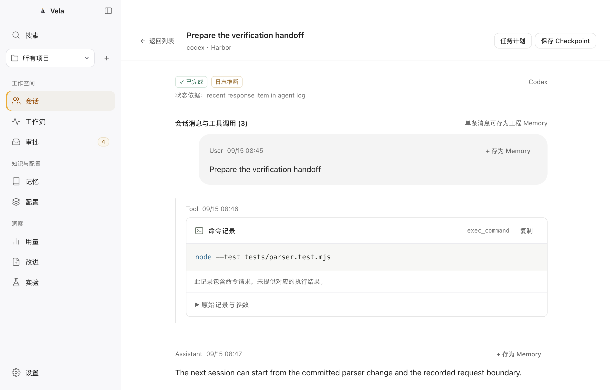

# Blume 1.0.74：功能与交互核对

日期：2026-09-15。Vela 基线：`cc3bec71222c13347674691cca06865ba1fdfb36`。本轮先核对 Blume；不以局部美化、已有页面或测试数量宣告产品对齐。

**结论：Vela 尚未达到 Blume 的完整功能与交互等价。** 本轮将原有 B01–B52 全部逐项复核，新增 24 条原生观察记录。可进入的主要页面已实际操作；登录后能力、未出现的非空状态、后台成功执行和真实多 provider 兼容仍明确待验。52 项是核对范围，不是 52 项通过。

## 证据范围

- 从官方更新地址重新下载 **Blume 1.0.74 arm64**，188,597,393 bytes；SHA256 `7058008a6224025f39d16f116aee2e6f54535f632358923fe97b8073ba5651df`。与原已保留下载一致，`codesign --verify --deep --strict` 通过，签名为 Blume AS。未进行本轮在线公证评估，未解包私有源码、提示词或资源。
- 使用本机官方 Blume 窗口，通过可访问性树和截图观察。参考截图只在本次审查会话中查看，未把用户真实项目/会话截图发布到仓库。下表是人工观察记录，不能替代自动重放脚本。
- Vela 使用隔离合成项目、真实 Swift helper 和 AppKit/WKWebView 包装器；关闭真实来源自动发现、使用非持久 Web 数据存储。当前 UI 21 项资源与被捕获副本逐一校验，详情见[机器证据](../evidence/2026-09-15-blume-native-comparison.json)。
- Blume 观察窗口约 400 px 宽；Vela 捕获为 1250×800 CSS px、2× 截图。**这不是同尺寸像素回归或全量可访问性验收**，本轮比较的是功能入口、信息层级和操作流程。
- [结构化逐项清单](blume-native-audit-2026-09-15.json)保留每个能力的观察 ID、Vela 源文件、证据级别和未关闭项；[原始台账](blume.md)中的历史测试结果继续保留。

## 从用户任务出发的改造依据

| 用户要完成的事 | Blume 本机可见的处理 | Vela 当前问题 | 重构完成条件 |
| --- | --- | --- | --- |
| 不离开代码工作便能判断谁需要处理 | 窄 sidecar、状态分组、短卡片；非活动记录独立进入；Pin 可收为悬浮条 | 大工作区侧栏占位明显，活动与已完成同屏；没有同等悬浮三态 | 活动入口优先；历史可达；普通/展开/收拢不丢选择与位置，多屏下可恢复 |
| 理解一个会话的进展 | Recent activity / Todos / Sub-agents 局部分页，步骤折叠、项目与 harness 关系 | 会话详情是长阅读页，计划/关系追加在下方；每个工具卡的说明层级偏重 | 同一会话内切换三类信息，摘要与原文逐层展开，返回恢复滚动和焦点 |
| 找到影响项目的配置 | Recent projects → 项目 Setup；本地与全局目录分开；类型多选筛选 | 当前主要按文件类型平铺，所有项目中的同名 AGENTS.md 缺足够项目辨识 | 项目身份、目录、作用域明确；同名文件不混淆；扫描截断/失败不伪装完整 |
| 看懂并修改文档 | 默认 Markdown，Content / Related / Details 分层；块级编辑入口 | 已有编辑闭环，但单行标题使用大文本编辑器；审批离开文档；Undo 后回列表 | 在文档上下文审阅和决定；不削弱冻结审批；修改/撤销后留在当前文档并显示最新内容 |
| 判断订阅额度并恢复连接 | Provider 为主的 Usage；加载和连接错误有对应说明与行动 | 默认先显示日志统计；账户在次级标签；Claude/Cursor 账户适配缺失 | 账户窗口、重置时间、最近成功时间优先；日志另看；缺登录、权限、过期、限流与离线各有准确恢复 |
| 决定一条改进是否值得采用 | 处理阶段、分析趋势、建议分别呈现；配置页面解释来源、范围与频率 | 多项底层能力已存在，但手动阶段/命令配置暴露过多，未形成轻量连续处理体验 | 来源 → 证据 → 变更 → 决定 → 已处理/撤销有清楚路径；真实后台处理和效果另验 |
| 调整工具而不当管理员 | 设置按任务分组，缩放/密度带预览，路径排除独立页面 | 排除和备份已有 Core/CLI，但缺桌面入口；缺一致缩放和密度 | 常用偏好无需技术知识；高级诊断按需展开；所有有影响的操作先解释范围 |

这里的“改造完成条件”是 Vela 的实施要求，不冒充本轮已验证的 Blume 隐藏行为。保留 Vela 的 Memory、Workflows、审批、Library 和 Lab；这些额外能力需要合理的扩展导航，不能为模仿四个主标签而藏掉已有功能。

### 需要纠正的判断

1. **Pin 不是窗口置顶。** 已实际往返普通窄窗 → 收拢悬浮条 → 展开 → Unpin。本轮尝试的普通置顶/缩窄提案已撤回，未合入源码。
2. **代码渲染已经存在，问题是阅读结构。** 当前原生命令卡有语法着色、复制与原始记录披露；下一步应优化摘要、结果/缺结果、分组和展开方式，避免重复造渲染器。
3. **排除功能不是从零开始。** Core 已有规则增删、投影撤回和访问限制，缺的是可用的桌面入口及完整用户流程。
4. **Analytics 不再能一概列为 Soon。** 本轮 1.0.74 的独立分析页实际可打开。周报同样已有设置入口，但未验证实际生成/导出，不能直接标成功。
5. **“看到了按钮”不等于完成操作。** Blume 文档 Edit block 本轮未进入可确认的编辑器；Improve 当前无建议；Usage 只得到连接失败态。不得由这些入口推导保存、模型处理、额度或效果均正确。

## 本轮 Vela 原生验证

合成 `Harbor/AGENTS.md` 的标题从 `Working on Harbor` 改为 `Harbor project instructions`，正文保持不变：

1. 打开当前 Markdown，进入标题块编辑，修改后审阅完整差异。
2. 提交前检查文件仍是原内容；提交冻结审批后从原生 Inbox 批准精确请求。
3. 核对磁盘字节，只发生该标题改动；重新打开文档，观察最新内容及修改记录。
4. 明确确认 Undo，核对完整文件 SHA256 恢复为 `09468612d36d7a2ceef987c9bf67964efc972f7198dbd0127ec510ffe50895b0`。

该路径通过，0 次 provider/model 调用，未修改真实用户项目。首次审批 AX 点击在刷新后失效，工具未执行；重新获取当前请求后成功。它提示动态页面的定位/焦点稳定性需要后续验证，不证明重复执行。**这是一条原生正常路径，不能替代已有 13 条浏览器旅程、完整原生故障矩阵或 Improve 验收。**

本轮合成原生截图，均为重构前基线：

| 页面 | 截图 |
| --- | --- |
| 活动/已完成列表 | [会话列表](../assets/audit-20260915/sessions.png) |
| 命令记录及会话阅读 | [会话详情](../assets/audit-20260915/session-detail.png) |
| 写入后的当前文档与 Undo | [文档详情](../assets/audit-20260915/document-applied.png) |
| 日志统计优先的默认用量页 | [用量页面](../assets/audit-20260915/usage.png) |

## Blume 原生观察记录

| ID | 入口 / 覆盖程度 | 实际观察及限制 |
| --- | --- | --- |
| N01 | Agents 活动页；实际导航 | 约 400 px 窄窗；状态分组、短标题、项目、相对时间、Dismiss 入口；底部 harness、搜索和设置。未隐藏真实会话。 |
| N02 | Inactive 历史页；实际导航 | Show inactive 打开独立 last 7 days 页面，按日期分组，有 Back、Refresh；进入并返回。未验证七日以外完整历史。 |
| N03 | 会话详情与菜单；实际导航 | 标题、branch、运行时间、turn、更新时间与项目/harness 关系；Recent activity、Todos、Sub-agents 三页。当前更多菜单看到 Copy conversation 和 Open worktree/path in；未执行复制、续接或外部打开。 |
| N04 | 活动、计划、子代理；部分状态 | 活动中的工具请求压为 step/tool call 折叠行；Todos 和 Sub-agents 实际进入空状态。Open conversation 只见入口；非空计划、子代理图和完整 transcript 未复测。 |
| N05 | Setup 首页；实际导航 | Recent projects 与 Global artifacts 分组；项目卡有简短路径、数量、更多入口；全局项区分 MCP、配置和目录。 |
| N06 | 项目 Setup；实际导航 | 项目头部下分 Setup、Conversations、Worktrees。Setup 区分本项目与全局来源、目录/文件和 Show all；当前项目显示达到扫描上限提示，不能把该清单当完整扫描结果。 |
| N07 | Artifact 文档；实际导航 | AGENTS.md 默认 Markdown 阅读；Content、Related、Details 分开；块级 Edit block 入口可见。点击首个编辑入口未出现可确认的编辑器，未保存任何 Blume 文件。 |
| N08 | Artifact 关系与详情；实际导航 | Related 实际显示无关联；Details 用类型、provider、scope、influence、composition、source type、短文件名的定义列表。未验证非空关系和版本恢复。 |
| N09 | Artifact 筛选菜单；实际打开 | 全局类型多选菜单可见 All types、Configuration、Instruction、MCP server、Plugin、Skill；数量随已加载项目而定。未以未出现的类型推断产品不支持。 |
| N10 | 账户用量；失败态实测 | Usage 先 checking/skeleton，刷新暂不可用；随后 Claude Code 为 Not connected，给出打开终端、复制登录命令、完成登录、返回刷新的步骤；Codex 为 operation aborted。未得到成功账户额度。 |
| N11 | Improve 首页；实际导航 | Beta；Processing summary 分 Signals、Clusters、Conversations；Analytics 与 Suggestions 分区。建议当前为空，未执行建议的 Preview/Apply/Snooze/Undo。 |
| N12 | Analytics；实际导航 | 当前版本可进入独立页面，last 30 days、Corrections/Steering/Frustration、待比较状态、以 user turns 为分母及多日趋势条件。未得到非空趋势质量验证。 |
| N13 | Improvements 设置；只读设置 | Connected plans、空闲/额度窗口/关闭的处理方式、plan priority、来源、项目/global scope、Rules/Hooks/Skills/Docs、自动 Setup audit 和 Weekly 频率入口可见。优先级区域仍 loading；未改变设置或验证后台处理成功。 |
| N14 | 搜索；入口已打开 | Cmd+F 打开搜索，Conversations/Messages/Projects/Setup/Suggestions 分类，当前上下文类别及全局快捷键提示；未执行精确消息命中、高亮和返回源位置测试。 |
| N15 | 设置结构；实际导航 | Personalization、Intelligence、App 分组；Appearance、Behavior、Theme、Share、Improvements、Menu Bar、System 使用摘要行进入专页。 |
| N16 | Appearance；只读设置及预览 | 缩放 90/100/110/125/150%，包括图标与间距；petal effects、Sections All/By status、Cards Regular/Compact；实际展开合成卡片预览，未改偏好。 |
| N17 | Behavior；只读设置 | Weekly Wrapped 开关与说明、Excluded Projects 路径/glob 输入、选择目录与 Add rule。说明索引删除范围、项目源文件保留和移除规则后重新发现；未执行排除或生成周报。 |
| N18 | Menu Bar；只读设置 | 开关、彩色状态、Filled/Bordered；Menu bar contents 与 Pinned mode contents 独立。打开内容菜单，看到状态数量、Agents/Usage 和 Claude/Codex usage 等选项；未改偏好。 |
| N19 | Pin；可逆往返操作 | 普通窄窗 → 约 180 px 宽悬浮条 → Expand pinned 恢复完整页面 → Unpin 返回普通窗口。已恢复 Pin 关闭。悬浮条不是仅把原大窗口置顶。 |
| N20 | Theme 与分享；只读设置 | 可选与锁定主题、分享/邀请解锁入口；未改主题、未登录、未分享。创建邀请链接中不等于已生成可用链接。 |
| N21 | System 与菜单；实际导航 | System 实见登录时启动开关；原生菜单可见 About/Services/Hide/Quit 等。未确认更新通道、安装 MCP、备份、账号管理入口，不能据此判定不存在。 |
| N22 | Feedback；实际导航 | 支持聊天入口、功能请求列表、状态/评论/投票入口；经历加载后列表成功出现。未联系团队、提交、投票或留邮箱；板上 Shipped 标签不是本轮功能执行证据。 |
| N23 | 项目 Worktrees；空状态实测 | 从项目详情切换到 Worktrees，显示 No worktrees found for this project。非空 worktree 发现、打开和身份关系未验证。 |
| N24 | 项目 Conversations；列表实测 | 从同一项目切换 Conversations，可见关联会话、provider、相对时间、Running/Inactive。未把列表出现当作所有项目关系正确。 |

## B01–B52 功能逐项映射

以下各行保持未关闭。Vela“已有”分别来自本轮原生观察、当前源码或明确标出的历史验证；不代表两个产品已经等价。详细证据级别见同名 JSON。

### Agents 与会话

| ID / 功能 | Blume 本轮范围 | Vela 当前状态 | 差距 / 下一项验收 |
| --- | --- | --- | --- |
| B01 五 harness 发现 | 官方声明；本机只确认已配置入口（N01） | [实现位置](../../Sources/VelaCore/FoundationService.swift)：FoundationService 列 Claude/Codex/Cursor/Pi/OMP；本轮只用隔离 fixture 查看列表。 | 分别验证五种真实安装/未安装/遗留目录与 GUI PATH；当前不能判为五 provider 全量对齐。 |
| B02 Claude 消息摄取 | 完整格式未复测（N01、N04） | [实现位置](../../Sources/VelaCore/SessionEngine.swift)：合成 Claude 消息和待审批行能展示；常见 JSONL reader 已有。 | 逐版本真实消息、工具配对、分段/中断及错误展示；合成行不代表真实兼容。 |
| B03 Codex 消息摄取 | 真实会话可进入；完整格式未复测（N03、N04） | [实现位置](../../Sources/VelaCore/SessionEngine.swift)：合成 Codex 详情、命令记录和正文在原生窗口可读。 | 完整输出类型、长文本、累计事件与日志替换；同输入逐段比较，不从一条命令推断全覆盖。 |
| B04 Cursor 消息摄取 | 本轮未运行该 provider | [实现位置](../../Sources/VelaCore/SessionEngine.swift)：存在已知 composerData SQLite 与导出格式 reader。 | 当前 schema 与拆分 bubble、导入/实时状态、损坏库及非空 UI。 |
| B05 Pi 会话 | 本轮未运行该 provider | [实现位置](../../Sources/VelaCore/PiSessionReader.swift)：PiSessionReader 支持已知线性/树状版本。 | 真实版本 fixture、分支、工具结果和错误状态；未知版本保持不可用。 |
| B06 OMP 会话 | 本轮未运行该 provider | [实现位置](../../Sources/VelaCore/PiSessionReader.swift)：同 reader 明确区分 OMP，已有 title slot/树读取。 | 迁移目录、标题变化、扩展角色和外置内容；真实端到端未关闭。 |
| B07 增量与完整历史 | 七日历史导航已操作；全历史未验（N02） | [实现位置](../../Sources/VelaApp/Resources/UI/app.js)：默认页面混排活跃、完成、空闲；另有显式历史导入/分页能力。 | 把活动与非活动历史的日常入口分开，保留高级导入；返回位置、刷新、日期分组及大数据分页分别验收。 |
| B08 分支与工作区身份 | 项目会话列表与 worktree 空态已见（N06、N23、N24） | [实现位置](../../Sources/VelaCore/SessionEngine.swift)：canonical 项目路径和部分持久化分支；缺同等项目 Setup/Conversations/Worktrees 导航。 | 非空 worktree 关系、同名项目、路径变化和跨页返回；空态不算关系验证。 |
| B09 会话状态与排序 | 活动/非活动显示可见；全部终态未验（N01、N02、N03） | [实现位置](../../Sources/VelaCore/SessionEngine.swift)：有推断状态与来源说明，当前列表将所有分组堆在同页。 | 稳定活跃排序，状态变更不跳焦点；真实停止、等待、恢复及五 provider liveness 证据。 |
| B10 等待/完成通知 | 状态入口已见；系统通知未验（N01、N18） | [实现位置](../../Sources/VelaApp/main.swift)：NotificationPolicy、原生路由、提示音已实现；历史环境中 OS 拒绝通知授权。 | 签名应用获得实际系统授权后验证 banner、分组、静音与准确回到会话。 |
| B11 工具调用与结果 | 折叠步骤已见；多类型结果未验（N04） | [实现位置](../../Sources/VelaApp/Resources/UI/content.js)：有 Markdown/代码渲染器、命令摘要、复制、原始参数披露；缺结果明确说明。 | 摘要优先，展开查看参数/输出；长命令、并行调用、错误、缺结果和代码换行，不把请求标成功。 |
| B12 Todo / 计划 | 独立页空态已操作（N04） | [实现位置](../../Sources/VelaCore/SessionPlanService.swift)：SessionPlanProjection/Service 与详情入口已有；当前布局把计划内容放在会话长页中。 | 活动/计划/子代理局部导航，非空计划与来源、未知/失败/完成分开；完整版本兼容另验。 |
| B13 子代理关系 | 独立页空态已操作（N04） | [实现位置](../../Sources/VelaCore/SessionRelationService.swift)：Codex 受限关系投影、分页、独立状态和详情区域已有。 | 局部页展示并保留导航；非空多层关系、跨项目拒绝、历史边界和真实生命周期。 |
| B14 标题/摘要生成 | 短标题展示已见；生成机制未验（N03） | [实现位置](../../Sources/VelaCore/SessionEngine.swift)：使用源标题或首条用户消息，无同等模型摘要生成。 | 保留原始标题、可读展示与完整查看；若生成摘要须可追溯且失败可退回源标题。 |
| B15 改名与恢复标题 | 本次菜单未见；不判缺失（N03） | [实现位置](../../Sources/VelaCore/SessionEngine.swift)：尚无同等修改接口。 | 先确认参考入口与写回边界，再实现独立别名或受审写回、冲突检测和撤销。 |
| B16 项目/路径排除与恢复 | 专页和规则入口已见；未删真实索引（N17） | [实现位置](../../Sources/VelaCore/IngestionExclusionService.swift)：IngestionExclusionService 已有 list/upsert/remove 与隔离检查；桌面 UI/bridge 未接。 | 把现有安全服务接入设置专页；预览影响、添加、撤回、恢复、搜索/Recall 隔离和准确文案。 |
| B17 同 harness Continue | 当前菜单未确认（N03） | [实现位置](../../Sources/VelaCore/MemoryService.swift)：Checkpoint 为中立说明，无原生 resume。 | 不能用复制说明当续接；取得公开 resume 契约后验证实际项目、会话 ID 与失败恢复。 |
| B18 跨 harness Transfer | 本轮未确认，旧报告含灰度（N03） | [实现位置](../../Sources/VelaCore/MemoryService.swift)：Checkpoint 导出不等于目标 agent 继续。 | 源快照、目标兼容、显式授权、真实目标任务继续与错误恢复。 |
| B19 内嵌终端 | 本轮未确认（N03） | [实现位置](../../Sources/VelaCore/AutomationProcess.swift)：无通用 PTY；AutomationProcess 执行冻结请求。 | 先确认参考成熟入口；若接通需输入/尺寸/停止/重连及进程回收，不能拿命令展示当终端。 |

### Setup、Search 与 Improve

| ID / 功能 | Blume 本轮范围 | Vela 当前状态 | 差距 / 下一项验收 |
| --- | --- | --- | --- |
| B20 配置清单与层级 | 目录、类型筛选、范围与截断提示已见（N05、N06、N09） | [实现位置](../../Sources/VelaCore/SetupInventoryService.swift)：已有类型清单和版本扫描；当前按类型平铺，所有项目下同名文件缺足够项目区分。 | 项目入口→本地/全局目录→类型筛选→文档；显示实际项目名、相对来源、扫描不完整状态。 |
| B21 文档详情、编辑、历史 | 阅读/关系/详情已操作；参考编辑保存未验（N07、N08） | [实现位置](../../Sources/VelaApp/Resources/UI/app.js)：本轮原生标题块编辑→diff→冻结审批→精确写入→Undo 逐字节恢复通过。 | 文档内完成审阅并保留上下文；单行字段不用巨大编辑器；撤销留在文档；完整类型与冲突矩阵仍开放。 |
| B22 配置审计语义 | 周期设置入口可见；诊断执行未验（N13） | [实现位置](../../Sources/VelaCore/SetupInventoryService.swift)：setup.audit 主要格式、重复与保守大小检查。 | 按类型解释问题和影响，再提供可审变更；规则冲突、失效引用、MCP 漂移要有正负例。 |
| B23 周期审计和抑制 | 自动审计/Weekly 入口可见（N13） | [实现位置](../../Sources/VelaApp/Resources/UI/app.js)：没有同等独立完整审计策略 UI。 | 频率、停用、Dismiss 抑制、源变化重评与无变化不重复推送；不能只接定时按钮。 |
| B24 Artifact 同步与冲突 | 本轮未确认 | [实现位置](../../Sources/VelaCore/SafeApply.swift)：本地 Markdown 与 SafeApply；无同等跨设备同步。 | 保留目标但先核实公开契约；所有权、可选同步、离线冲突与恢复不可由本地导出替代。 |
| B25 多对象搜索 | 分类入口已打开；实际命中未验（N14） | [实现位置](../../Sources/VelaApp/Resources/UI/app.js)：全局搜索和 actions 有 UI；缺 Blume 五对象类别筛选与同等精确返回体验。 | 上下文/全局边界、键盘类别、匹配高亮、精确消息定位、返回保留查询与隐私隔离。 |
| B26 Raycast 入口 | 本轮未确认 | [实现位置](../../Sources/VelaCLI/main.swift)：无专用集成。 | 先核实参考公开入口，再测搜索、冷启动、准确目标和离线失败。 |
| B27 纠错/引导/摩擦识别 | 处理总览与分析页可见；非空证据未验（N11、N12） | [实现位置](../../Sources/VelaCore/ModelImprovement.swift)：确定性检测与受审批的 Codex 模型提取已有。 | 信号→原始消息可返回；类别与用户语言可理解，真实正负样本和提取质量另验。 |
| B28 跨会话聚类/阈值 | 阶段入口可见；聚类成功未验（N11、N13） | [实现位置](../../Sources/VelaCore/ModelImprovement.swift)：来源去重、模型聚类、严格阶段 ID；显式选会话执行。 | 持续增量、近似/冲突、每阶段数量与真实进度、可取消恢复；不能用统计数字代替证据链。 |
| B29 模型规划操作 | 官方 beta 说明；当前建议为空（N11、N22） | [实现位置](../../Sources/VelaCore/ModelImprovement.swift)：三阶段与五载体 create/update 已有真实 Codex 合成来源历史证据；删除规划不全。 | 完整 create/update/remove、候选修订与重新冻结；逐文件 diff 和实际任务改善仍需验证。 |
| B30 Connected plans | Claude/Codex 选项可见；priority loading（N13） | [实现位置](../../Sources/VelaCore/ModelImprovement.swift)：只能显式选择 Codex CLI/model，无其他分析 backend。 | 按已连接账户展示选择和修复，选择与 observed model 分开；多 provider 成功/拒绝/失效路径。 |
| B31 手动/空闲/额度末段触发 | 设置模式可见；后台成功未验（N13） | [实现位置](../../Sources/VelaCore/ModelImprovement.swift)：模型 pipeline 是 manual-only，已有预算上限。 | 明确 opt-in、真实 idle/额度信号、预算、去重和停用；不自动消耗未知额度。 |
| B32 Harness / project / global / 类型范围 | 范围选择可见；未变更（N13） | [实现位置](../../Sources/VelaCore/ModelImprovement.swift)：模型同项目输入及显式 carrier/path，完整范围策略未完成。 | 按目标来源组织设置；新增 provider 不扩大权限；禁用范围不进入提案。 |
| B33 Evidence / Diff / Apply / Undo | 官方说明；本轮无建议可执行（N11） | [实现位置](../../Sources/VelaCore/SafeApply.swift)：SafeApply 已有；本轮只证明 Setup 单一原生写入/Undo 路径，不是 Improve 全流程。 | 建议详情中按证据→操作→差异→决定呈现；多文件冲突/故障点/恢复，不能从 Setup 成功外推。 |
| B34 Snooze / Dismiss / Resolved / 修订 | 官方说明及请求板状态；本轮未执行（N11、N22） | [实现位置](../../Sources/VelaCore/ModelImprovement.swift)：已有带 hash 的 Snooze/Dismiss/Reopen；完整修订流程仍缺。 | 已处理与待处理分流，延后到期、拒绝原因、编辑后重审及 Undo 返回位置。 |
| B35 Cloud Improve 与同意撤销 | 本轮未登录/未确认 | [实现位置](../../docs/architecture.md)：无 Vela 云 Improve。 | 保留需求而不暗中联网；先核实必要结果和数据合同，再明确同意、撤销与本地失败处理。 |

### 额度、桌面与其余能力

| ID / 功能 | Blume 本轮范围 | Vela 当前状态 | 差距 / 下一项验收 |
| --- | --- | --- | --- |
| B36 Claude 账户窗口与连接修复 | 未连接修复路径已见；额度成功未验（N10） | [实现位置](../../Sources/VelaCore/ProviderQuotaService.swift)：暂无 Claude 额度 adapter；日志 token 不能替代账户窗口。 | 正常/无登录/Keychain 拒绝/过期/限流/离线逐态实测及对应恢复操作。 |
| B37 Codex 账户窗口和重置 | 参考请求中止；正常额度未验（N10） | [实现位置](../../Sources/VelaCore/ProviderQuotaService.swift)：官方 app-server quota read/status 已有，历史真实读取成功；本轮未再读真实账户。 | 默认入口体现账户窗口、刷新/陈旧/错误；不要藏在日志表后；重置时区、同账号多 bucket 与重试。 |
| B38 Cursor 用量与额度 | 本轮未出现对应已连接账户 | [实现位置](../../Sources/VelaCore/ProviderQuotaService.swift)：无账户 quota adapter；部分日志 usage。 | 先核实版本/账号能力；缺失显示不可用并给原因，真实连接与限流另测。 |
| B39 费用、历史、菜单栏用量 | 菜单栏内容选项已打开；真实费用未验（N18） | [实现位置](../../Sources/VelaApp/main.swift)：无同等费用或菜单栏用量；costAvailable=false。 | 菜单栏独立信息选择、窗口/更新时间/陈旧状态；费用必须来自可追溯价格或提供方。 |
| B40 窄窗、Pin 和菜单栏 | Pin→悬浮条→展开→Unpin 已往返（N01、N18、N19） | [实现位置](../../Sources/VelaApp/main.swift)：现有最小窗口 900×620，普通菜单栏；缺窄 sidecar 和收拢悬浮条。 | 按内容重新组织窄布局与完整工作区，三态切换保留位置、焦点和选择；多屏/缩放/重启/关闭回收。 |
| B41 首次引导和认证 | 修复引导已见；未重置首启（N10） | [实现位置](../../Sources/VelaApp/Resources/UI/app.js)：主要手动加项目；没有完整 provider-aware 初次路径。 | 干净安装→发现 provider→缺失/权限恢复→首条会话；跳过/返回/离线/不创建假数据。 |
| B42 更新与发行通道 | 本轮未确认更新安装入口（N21） | [实现位置](../../Sources/VelaApp/main.swift)：dev/canary/stable 身份；当前 ad-hoc 包，无已验证更新机制。 | 签名/公证、检查/下载/安装/回滚、数据迁移和网络失败；通道字符串不代表更新完成。 |
| B43 MCP 读写贡献和安装 | 本轮未确认 Blume 对外 MCP 入口（N21） | [实现位置](../../Sources/VelaCLI/main.swift)：受限 MCP 查询/贡献与手工配置已有。 | 区分 Setup 检查第三方 MCP 与产品自身 MCP；安装预览/Undo、精确客户端接入和最小权限。 |
| B44 本地数据与账号控制 | 排除说明可见；完整管理未验（N17、N21） | [实现位置](../../Sources/VelaCore/StoreBackupService.swift)：本地存储、CLI backup/restore；桌面没有等价备份/恢复入口。 | 设置内可理解的数据位置、备份验证、恢复预览、选择性删除和撤销连接；原始文件与索引分开。 |
| B45 反馈/请求/支持 | 支持与功能请求板已打开（N22） | [实现位置](../../Sources/VelaApp/Resources/UI/app.js)：GitHub Issues/社区文档；没有内建同等支持导航。 | 产品内帮助和反馈入口、可预览诊断；run feedback 是执行评估，不能冒充产品支持。 |
| B46 账户/设备/邀请/公告 | 邀请和分享入口已见；账号/设备未验（N20、N22） | [实现位置](../../docs/architecture.md)：无对应账号系统。 | 先核实必要用户结果；不为复制主题锁定而强制账号；分享内容预览、取消及真实可用链接。 |
| B47 主题、缩放、密度、周报 | 缩放/密度预览和周报开关已见（N16、N17、N20） | [实现位置](../../Sources/VelaApp/Resources/UI/app.css)：中英文、主题和图标已有；缺系统化缩放、密度与周报。 | 90–150% 可读性、紧凑/标准预览、reduce motion；周报必须真实统计，生成/导出尚未确认。 |
| B48 Analytics 趋势 | 本版本已有可访问分析页，不能仍标纯 Soon（N12） | [实现位置](../../Sources/VelaCore/ImproveService.swift)：日志统计和 Lab 对照不是相同 signal trend。 | 统一三类信号、时间范围、分母、缺失与多日比较；没有改善结果不绘制虚假提升。 |
| B49 Domain Model | 公开路线图；本轮未确认交付 | [实现位置](../../docs/architecture.md)：项目资产不等价完整 domain model。 | 保留目标与证据不足，不从产品主页词汇推导实现；意图来源、权限、版本与冲突另定。 |
| B50 Team Conflict Resolution | 公开路线图；本轮未确认交付 | [实现位置](../../docs/architecture.md)：未实现完整团队冲突解决。 | 必须先有真实双方证据、权限及人工决定路径；不能把本地文件冲突保护算作团队能力。 |
| B51 Auto-Improve Mode | 后台处理设置可见，不等于自动效果验收（N13） | [实现位置](../../Sources/VelaCore/ImproveService.swift)：Lab 与显式晋升已有；完整自动验证循环未验。 | 区分自动提取建议与自动验证改进；同任务对照、失败拒绝、真实后续改善及回滚。 |
| B52 Windows/Linux | 官方发行说明；本轮只测 macOS | [实现位置](../../README.md)：产品范围目前为 macOS。 | 平台差异明确保留，不能宣称跨平台完全替代；本轮 UI 对齐不扩为多平台重写。 |

## 重构顺序与验收门槛

这些是依据已观测流程排定的工作顺序，本轮没有把它们算作已完成代码或新架构决策。

1. **应用框架与会话。** 先确定窄 sidecar / 完整工作区 / 悬浮条关系，再做活动、历史、会话局部导航。先验证正常内容、长标题、空态、错误和连续刷新，再统一样式；不先将全应用强行压到 400 px。
2. **项目配置与文档。** 项目/全局目录、语义图标和类型菜单、文档三个层次；将已有安全编辑与撤销放回当前上下文。固定文件名、作用域和主行动的层级，不把 hash、完整绝对路径、脱敏内部术语作为默认正文。
3. **账户额度与 Improve。** 账户卡先解决连接与恢复；日志保留为独立观察面。Improve 按实际处理阶段、来源证据和建议生命周期组织；后端未接的 provider 或自动模式保持明确不可用。
4. **设置、搜索、支持。** 接通已有排除/数据管理能力，缩放与密度预览、分类搜索、帮助与反馈。每项验证进入、取消、应用、保存、恢复和重启后的状态。
5. **逐页横向回归。** 双语、深浅色、90–150% 缩放、长标题/路径/代码、键盘与屏幕阅读器、菜单避边、后台刷新不丢焦点/草稿、同名项目与跨项目晚回包。先覆盖已实现功能，再分别补登录后和真实 provider 场景。

原生窗口/bridge 或后台执行边界若需实质改变，应另外记录 ADR；保持 Swift/AppKit/WKWebView 的默认运行时。资源验收记录主进程、helper 与可归属 WebContent，测启动、操作和空闲；本轮未重跑性能测试，不能从较小包体或无 Electron 推导资源预算已达标。

## WorkBuddy 调用状态

已通过 WorkBuddy 界面确认选择 **Deepseek-V4.1-Flash**，将当前 UI 的冻结副本和本轮 brief 放入隔离工作目录并尝试发送。恢复任务返回 `session/resume timed out / UNKNOWN_STOP_REASON`；未生成本轮设计说明或代码。因用户随后要求先完成逐项核对，本轮没有重试生成或将旧草案合入客户端。后续可直接使用本报告作为设计输入；不能把该模型标为本轮重构作者。

## 未覆盖与证据边界

- 无 Blume 成功账户额度、非空 Improve 建议、非空子代理/计划/worktree 图的端到端操作证据；不更改真实参考项目来制造状态。
- 未触发真实产品支持消息、投票、邀请分享、登录、配置写入或索引删除。可见入口不等于后台成功。
- Resume、跨 harness transfer、PTY、Raycast、更新安装、MCP 安装、设备管理、同步等未确认项继续保留，不能写“Blume 没有”或从旧逆向报告推导本版可用。
- 本轮修改是核对报告和证据，不是新 UI 交付；原生全量回归、三项目超集和完整规格总验收仍未通过。

## 收尾检查

恢复当前源码后 `swift build --jobs 2` 通过；仓库检查、52/24项映射一致性、链接与截图 hash 检查通过。已退出本轮参考客户端与原生 QA、停止本轮预览服务，移除合成 store/QA 包及重复下载，共 203,136,277 bytes（约194 MiB）。保留原始参考安装包、可复用依赖、审查证据和下一轮设计输入；未删除预存缓存或用户数据。本轮没有运行完整 XCTest/原生回归。

## 官方来源与 English summary

官方页面用于核对公开声明，不替代上面的本机观察：[产品首页](https://blume.codes/)、[1.0.56 发行说明](https://blume.codes/blog/you-already-told-your-agent-that)、[Improve 操作与边界](https://blume.codes/blog/how-blume-codebase-improvements-work)、[Claude Usage 修复指南](https://blume.codes/docs/claude-usage-mac)。本轮原生版本比早期发行说明更新；发生差异时按“当前入口 / 公开承诺 / 尚未验证执行”分别保留。

This audit maps all 52 existing Blume capability items against Vela and records 24 bounded observations from the official Blume 1.0.74 macOS client. Vela is **not yet at feature or interaction parity**. One isolated native Markdown edit, reviewed approval and byte-exact undo round trip passed. The reference quota attempt failed; populated improvement, plan and sub-agent flows remain unverified. The redesign must preserve project context, separate active/history views, provide purposeful document and quota interfaces, and implement a real collapsible companion rather than merely pinning a large window. No new desktop UI was merged in this audit.
