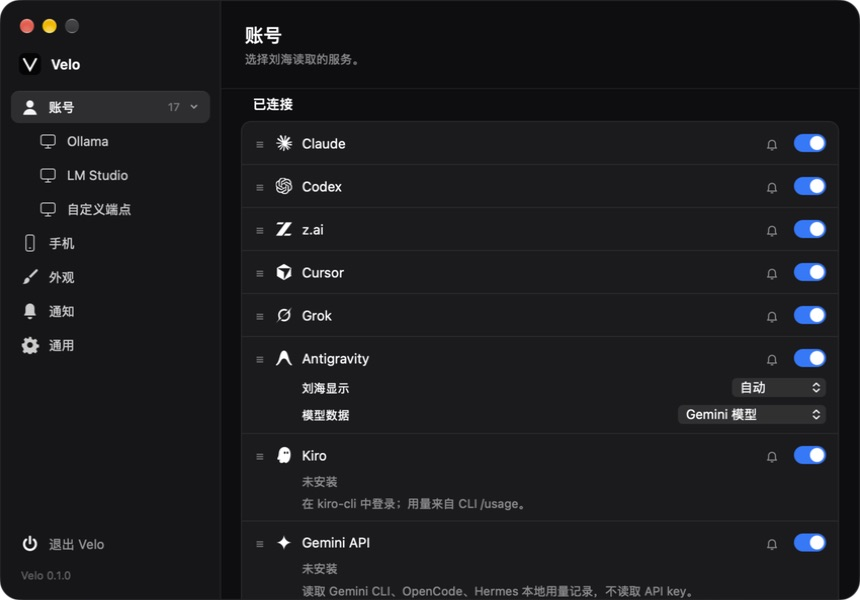
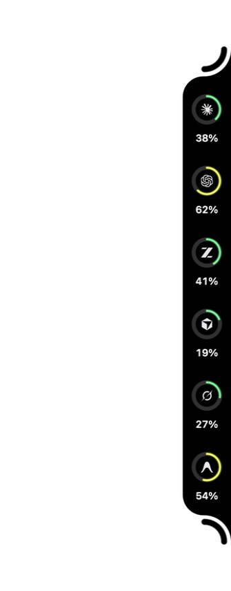
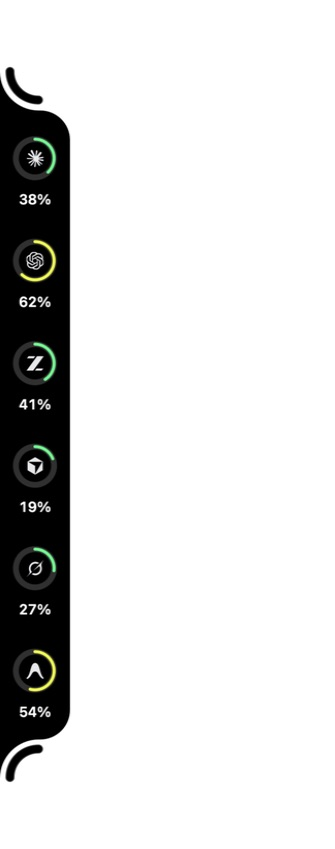
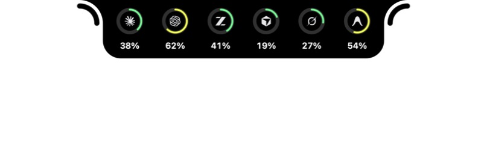
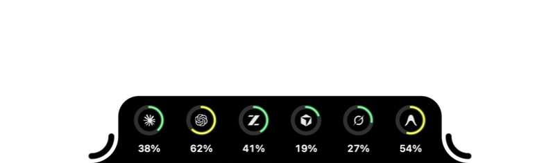

# 原生迁移阶段验证 · 2026-09-23

**这是局部修复证据，不是全量 Swift 迁移验收。** 所有 Velo 截图来自本机运行的 Tauri / WKWebView；数字来自隔离的 `--visual-test` 快照，没有启动供应商采集或使用真实账户。

## 基准

- Swift 固定提交：`vinzdg/codenotch@117a38b8edae2ebd0944bc86b8760c6381685345`。
- 运行与该提交一致的 [官方 Package CI 产物](https://github.com/vinzdg/codenotch/actions/runs/35702125348)，使用 `CODENOTCH_DEMO=1`；为隔离配置，仅更改测试副本 bundle 标识、显示名称、更新元数据并做临时签名，未修改其 Swift 实现。
- `swift-reference-left-three.png` 是官方 Demo 原版。Velo 的账户、读数与其不同，不能把这两张图当作相同 fixture 的像素差异测试。

## 本轮实现和验证

| 项目 | 结果 |
| --- | --- |
| 六账户长条截断 | 窗口按内容、屏幕和缩放重新计算；拥挤时先减账户间距；两端弧线及手柄完整 |
| 四边形状 | 使用同一 `SideNotchShape` 圆弧路径与坐标变换，原生四边显示检查通过 |
| 收起形状 | 同一路径收缩到 `26 × 210` 设计像素；采用 `response=.42, damping=.78` 弹簧，原生收起截图及 WebKit 快速反向测试通过 |
| 图标 | 内置黑色模板 SVG 改为继承前景色，保留路径；原生六个内置标记显示正常 |
| 设置窗口 | 860×600、原生窗口按钮、暗色透明标题栏；原生截图检查通过 |
| 账户页 | 行内静音、单一连接开关、顺序；实际 IPC 关闭三个账户，原生圆环数量由六变三 |
| 应用入口 | Dock / 菜单栏 / 隐藏偏好，保留升级前托盘选择；原生菜单“设置”和 ⌘, 关闭后重开验证通过 |
| macOS 层级 | 恢复 statusBar level、跨 Space / 全屏辅助窗口标记；跨 Space / 真正全屏原生交互仍待验证 |
| 强调色 | 恢复原版 11 色、系统强调色读取、控件/低用量圆环/卡片联动；WebKit 测试通过 |
| 自动化 | Rust 主程序 197 通过、3 忽略；helper 1 通过；Node 13 通过；Chromium 22、WebKit 22 通过，单 worker |

CI 新增 WebKit，防止仅在 Chromium 通过而 WKWebView 显示缺失；远端执行结果另记录。

## 原生截图

## 仍未完成

- 系统强调色运行中改变时的完整同步、Liquid Glass、硬件刘海和多屏实例。
- 内容/手柄/卡片的全部 Swift 动画参数、曲线命中区域、拖动与窗口聚焦的逐交互原生对照。
- 所有设置页、登录/退出、清除缓存及正在执行请求的取消/隔离。账户连接开关本轮统一了读取启停和圆环成员，**尚不能视作 Swift 完整 sign-out**。
- DeepSeek / Qianwen 等网页登录、本地 runtime 指标及中转、全部活动生命周期与真实账户验证。
- Windows 实机视觉与交互；构建 CI 不等同于实机验收。

原生控制工具可以操作设置和应用菜单，但对不可聚焦的 Tauri 侧栏坐标点击报 `noWindowsAvailable`，因此本轮不把原生圆环 hover/click 标为通过。WebKit 的对应浏览器交互已通过。没有用关闭 Gatekeeper、修改真实账号或伪造原生操作来代替验证。

## 第二批：设置页原生对照（进行中）

本批对照继续使用固定 Swift SHA `117a38b8edae2ebd0944bc86b8760c6381685345`，但**设置页来自官方 Package CI 产物的正常模式**：Demo 模式不会构建 `SettingsWindowController`。参考包使用隔离的 bundle/配置副本；正常模式初次启动时默认启用 Claude/Codex，曾短暂只读访问本机账户。随后在参考副本关闭供应商，截图时账户数为 0，保存图片不含真实账户数据。它与上文 Demo 刘海截图是同一源码基准的两种运行模式，不能混作同一测试 fixture。

Velo 最终三页截图来自最新源码原生构建的独立 `--visual-test` root10；该模式没有启动供应商采集。截图显示运行时从 macOS SF Symbols 转出的真实图标、原生标题栏和分段控件。Swift 三图实际为 860×600 px，Velo 窗口截图为 860×601 px（窗口外框/取整产生的 1 px 差异，未裁改），Velo 源码 `inner_size` 仍为 860×600。两者品牌、账户数和示例数据也不同；这些截图用于核对主要版式与控件，不是像素一致性证明。此前在独立 root08 已进行一次真实 IPC 操作：将「重置时间」切到「剩余时间」，关闭设置窗口，再用 ⌘, 重开后选择仍在；随后恢复「重置日期」。这证明该偏好在隔离运行中经关闭/重开保留，尚不代表其他设置项均已迁移。

| 页面或路径 | 当前证据 | 边界 |
| --- | --- | --- |
| 外观 | [Swift 正常模式](swift-settings-appearance.jpg) 与 [Velo root10](velo-settings-appearance.jpg)：侧栏、标题、分组行、分段选择与开关可见 | 数据与账户数不同；滚动后各区、全部状态及无障碍尚未逐项验收 |
| 通知 | [Swift 正常模式](swift-settings-notifications.jpg) 与 [Velo root10](velo-settings-notifications.jpg)：会话结束、声音、额度分组及滚动条右边距可见 | 仍有局部纵向约 7 pt 差异与文案差异；试听 IPC 有浏览器断言，原生逐项交互待验 |
| 通用 | [Swift 正常模式](swift-settings-general.jpg) 与 [Velo root10](velo-settings-general.jpg)：登录启动、更新偏好、版本与检查入口可见 | Velo 预览版因未配签名 feed 禁用自动更新并给出说明；不宣称真实更新可用 |
| 更新设置 | 自动更新偏好默认关闭、原子保存；缺签名 key/HTTPS feed 时拒绝开启；后台下载后复核开关与许可代次 | Tauri 单次启动/开启检查已实现；Sparkle 周期调度、真实签名 feed、下载和安装未实测 |
| 刘海高度预算 | Rust 以固定的 Swift 高度公式计算，纳入 plan、token、reset 标志；探针排除祖先 CSS `zoom` 对量测的影响 | strict budget equality 已通过；这不是用 `fit_heights` 的 CSS 合成测量替代 Swift 公式，原生全场景仍待验 |
| 设置内容边距 | 滚动条占据约 12 pt 时补偿内容宽度，使通用（无 gutter）与通知（有 gutter）的右边距均为 20 pt | 浏览器跨页断言通过；最新原生三页截图已保存并查看 |

本批本地自动化单独计数：Rust 主程序 **204 通过、3 忽略**，helper **1 通过**（`/tmp/velo-final-parity-rust.log`）；Node **13 通过**；Chromium **28/28 通过**，包括通知页右对齐、两段说明、试听 IPC 与跨页 gutter 边距断言；WebKit **28/28 通过**。这些是本次修复后的结果，上文的 Rust 197 / Chromium 22 / WebKit 22 是上一批历史结果，未被本批重算或替换。最新源码原生构建通过，root10 三页截图已现场查看并保存。此处记录本地结果；本提交的远端 CI 结果按 GitHub Actions 对应 SHA 核对。macOS 原生操作与本地浏览器测试也不能代替 Windows 实机验收。

全量迁移仍未完成：Liquid Glass、硬件刘海与多屏；完整 sign-out、缓存清理与在途请求取消；网页登录；token/reset 卡片 UI；Sparkle 周期调度与可验证签名发布/真实安装；Windows 实机。设置页对照的技术发现及后续检查见[研究记录](../../../.trellis/tasks/09-22-swift-full-parity/research/settings-native-followup.md)，全量任务继续保持进行中。

## 第三批：同数据原生对照与生命周期（进行中）

`31b2457c870e7641e9e8e4ca86ab87cfbb7a8337` 的 browser、macOS、Windows CI 均通过（[run 35803774765](https://github.com/Atingaii/Velo/actions/runs/35803774765)）。本节后续工作树改动不包含在该 CI 结论中。

新增显式隔离参数 `--visual-test <empty-directory> --fixture swift`，使用固定源 `Fixtures.swift` 的 Claude / OpenAI / Perplexity 顺序及 73% / 21% / 52% 读数。root11 的原生构建已启动，不运行真实账户采集。参考副本重新以 `CODENOTCH_DEMO=1` 启动，通过原生右键菜单「保持展开」固定画面；截图须等展开动画稳定，不能将过渡帧误判为控件缺失。

- [Swift 稳定展开截图](swift-notch-left-fixture.jpg)：321×947 px。
- [Velo 修正前截图](velo-notch-left-fixture-before-review.jpg)：321×954 px。两者均为左侧、小尺寸；Velo 通过实际设置 IPC 保存外侧周圆环、用量节奏、关闭移动手柄和全屏收起。
- 只读像素测量（前 75 px、RGB 最大值小于 50）：Swift 主体最大宽度 54 px，Velo 为 56 px。Velo 还显示了错误的 OpenAI 文字占位和多余 `~`。这些差异已交回实现，截图是发现问题的证据，**不是一致性验收通过**。
- [Swift 自定义端点编辑表单](swift-settings-custom-editor.jpg)：正常模式下新建但未保存的空表单，无真实凭据。

阶段自动化：设置专项 6 项通过；Rust 主程序 209 项通过、3 项忽略，helper 1 项通过。新增生产门控竞态测试覆盖旧读取在关闭再开启后返回，无法写回 snapshot、archive 或完成事件，其他账户仍可提交。多窗实现仍在复核定向事件、拖动与显示器身份；本次通过不等于多屏原生验收。

另核实固定主线 `PhoneLink.isAvailable == false`：原版隐藏手机页并阻止服务器启动。迁移版保留协议代码与隔离测试能力，生产入口应遵循相同 gate；不能把主线尚未开放的手机端体验列为已交付。

## 第四批：启动死锁修复与实际 IPC

`2f39315` 的 macOS 和浏览器 CI 通过，Windows 的自有子进程回归因 `--exact` 名称缺少模块前缀失败；该测试未真正执行目标子进程分支，修复后需重新跑对应提交的 Windows CI。

本机隔离安装检查进一步发现 `ui_flags` 在同一 struct 表达式内连续获取相同 mutex，主线程因此阻塞，设置 WebView 无法完成 IPC。通过对本次隔离进程采集调用栈确认该原因；改为单次读取，并移除缩放、显隐及材质操作跨原生调用持有的状态锁。

重新构建后，将 debug 主程序和 helper 复制到本次专用 `Velo Parity.app` 并验证临时签名完整性。[实际安装应用 smoke 报告](installation-smoke-after-deadlock-fix.json) 显示设置 WebView/IPC 成功、helper 存在、供应商采集未启动、退出码 0 且未超时。用户 `/Applications/Velo.app` 未被替换。该次测试在锁屏期间通过，因此此前的启动失败不能解释为锁屏导致；新截图和交互对照仍需解锁。

后续 Rust 检查点为主程序 321、helper 1 通过、3 忽略，包括 Grok 自有临时文件的真实内核打开/关闭检测。内核返回的 `/private/var` 与临时目录 `/var` 拼写必须解析后比较，不能把别名差异当成未持有文件。

本节结果不代表最终 DMG/NSIS 已构建或验收，不代表 Gatekeeper 默认信任，也不代表所有设置与侧栏已达到视觉 1:1。

## 第五批：macOS 双架构 CI（ca25fff）

[CI 35836915542](https://github.com/Atingaii/Velo/actions/runs/35836915542) 的 browser、Intel macOS 15.7.9 和 macOS-latest 原生 job 均通过。隔离原生报告分别为 [Intel x86_64](macos-smoke-ca25fff-intel.json) 与 [Apple Silicon arm64](macos-smoke-ca25fff-arm64.json)：版本与包版本均为 `0.1.1-preview.1`，WebView/IPC、helper、wake subscription 成功，`providers_started=false`，exit 0 且未超时；两份诊断报告的 `matching_crashes` 均为空（[Intel](macos-diagnostic-ca25fff-intel.json)、[Apple Silicon](macos-diagnostic-ca25fff-arm64.json)）。

这些报告只证明对应 macOS runner 上的隔离启动 smoke，不覆盖 GUI 视觉、真实账号、发行安装或 Gatekeeper 验收。本节只记录 browser 与两项 macOS 结果；此前 Windows 报告保留为各自 SHA 的历史证据，不代表此提交的 Windows 验收。

## 第六批：仅 Mac 的当前迁移检查（eeb5335）

[CI 35840331022](https://github.com/Atingaii/Velo/actions/runs/35840331022) 的两项 Mac 原生作业与 browser 均通过。当前流水线不再运行 Windows 客户端检查，其他平台等待明确启动。新的 [Intel 报告](macos-smoke-eeb5335-intel.json)、[Apple Silicon 报告](macos-smoke-eeb5335-arm64.json)和[本机隔离应用报告](macos-smoke-eeb5335-local.json)均为 0.1.1-preview.1，WebView/IPC/helper/wake=true、providers_started=false、exit 0、无超时。

本机还通过 Rust 383 + helper 1 / 3 ignored、Node 33 及 UI 脚本检查；最新 debug app 已为原生视觉对照准备独立副本。Mac 仍锁屏，以上不能替代真实侧栏、材质、设置逐交互、真实账号及 DMG/Gatekeeper/签名升级验收。Mac 平台范围见 [ADR 0009](../../adr/0009-macos-first-delivery.md)。

## 第七批：实际发行 DMG（6859771，首次运行记录）

标签 `v0.1.1-preview.1` 固定于 `6859771f851ec28a21973f59146314b1d5a364a0`；[发行流水线 35842708336](https://github.com/Atingaii/Velo/actions/runs/35842708336) 的 browser 和 Apple Silicon 包作业已通过。Intel 通过 Rust 检查、主程序 release 构建和 `.app` 签名后，在 `bundle_dmg.sh` 约 22 秒处失败；日志只有通用打包错误，尚未执行 Intel 安装 smoke。发布 job 正确跳过，Release/feed 没有公开。该失败与此前已修复的 Intel 原生启动 SIGABRT 分开记录。

Apple Silicon runner 已挂载 DMG、复制 `.app`、校验签名完整性并执行[安装启动 smoke](smoke-macos-arm64-6859771.json)。Root 将该次流水线的同一个 DMG 下载至本机，验证磁盘映像、挂载并复制到独立临时目录，再次通过[本机 DMG 安装启动检查](smoke-macos-arm64-local-dmg-6859771.json)。两份报告均为 `0.1.1-preview.1`，WebView/IPC/helper/wake=true、providers_started=false、exit 0、无超时；未覆盖 `/Applications/Velo.app`。

[发行信任报告](trust-macos-arm64-6859771.json)明确区分：签名完整性通过；Developer ID、Gatekeeper 默认接受和公证票据均未通过。安装 smoke 不是首次系统允许打开的验证。

从同一 DMG 另建独立 bundle ID 的原生对照副本，仅修改包标识后临时签名；后续必须使用隔离 `--visual-test ... --fixture swift` 模式。Mac 仍锁屏，尚未操作或拍摄本次发行版原生界面。Sol/max 的有界只读终审未发现新的、可确认的高影响 macOS 实现遗漏；这一源码结论不替代视觉、真实账户或真实签名升级验收。

失败日志还确认 `CACHE_ON_FAILURE=false`，没有执行缓存保存。固定 Swatinem action 的 `post-if` 为 `success() || env.CACHE_ON_FAILURE == 'true'`，`save-if: true` 单独不足以在失败后保存缓存；后续 CI 配置需显式启用 `cache-on-failure: true`。这只减少重编译，不改变任何安装或签名门槛。

恢复验证 [35848207535](https://github.com/Atingaii/Velo/actions/runs/35848207535) 使用工作流 `5717393`，`source_ref=v0.1.1-preview.1` 固定客户端源码；每种架构的 `source.json` 记录实际 checkout SHA，不能把工作流 SHA 当作客户端 SHA。此次手动运行不会自动发布。后续真实升级验证复用同架构的 package 依赖缓存，临时旧源码仅将编译输出链接至 CI 工作区的 target；安装验证仍复制到全新的隔离目录，旧源码清理仅删除该链接并保留可复用编译缓存。

## 第八批：双架构发行与公开签名更新

恢复运行 [35848207535](https://github.com/Atingaii/Velo/actions/runs/35848207535) 的 browser、Apple Silicon 和 Intel 包作业全部通过。两份源码收据（[ARM](source-macos-arm64-35848207535.json)、[Intel](source-macos-x64-35848207535.json)）确认客户端仍为固定标签提交 `6859771f851ec28a21973f59146314b1d5a364a0`，工作流为 `571739356fc03838c996ad212b3259628b78a1c0`。此前 Intel DMG 失败在此次完整重建中未复现；尚不能断言先前失败的底层原因。

两架构均从实际 DMG 复制应用后完成 WebView/IPC、helper、wake subscription 检查，版本与包版本均为 `0.1.1-preview.1`，providers=false、exit 0、无超时（[ARM](smoke-macos-arm64-35848207535.json)、[Intel](smoke-macos-x64-35848207535.json)）。同一 ARM DMG 在本机独立副本再次[通过启动检查](smoke-macos-arm64-local-dmg-35848207535.json)。

Root 对两份真实更新归档使用应用内公钥和同版本 minisign-verify 验签，均通过；归档内容及受签名保护的版本说明分别篡改后均被拒绝。DMG 与更新归档中主程序、helper、Info.plist、CodeResources 的哈希一致（[ARM 验签记录](signed-artifact-macos-arm64-35848207535.json)、[Intel 验签记录](signed-artifact-macos-x64-35848207535.json)）。签名完整性通过，但 Developer ID、公证和 Gatekeeper 默认接受仍未通过（[ARM 信任报告](trust-macos-arm64-35848207535.json)、[Intel 信任报告](trust-macos-x64-35848207535.json)）。

核验后公开 [v0.1.1-preview.1](https://github.com/Atingaii/Velo/releases/tag/v0.1.1-preview.1)，没有移动标签。全部 13 项公开资产的 GitHub digest 与大小已与通过验证的本地文件核对；另从公开 URL 下载 ARM DMG，其 SHA-256 为 `8fa22fe8337094323382e4f846fdf6c5d9789da59fbdce42100a897b810effde`，与验证产物一致。[公开更新 feed](https://raw.githubusercontent.com/Atingaii/Velo/updates-preview/latest.json) 返回 200，版本为 `0.1.1-preview.1`，只含 darwin-aarch64 / darwin-x86_64，签名与对应已验证文件一致。

[本机真实升级报告](signed-update-macos-local-35848207535.json)证明隔离构建的 `0.1.1-preview.0` 经公开 feed 下载、验签、暂存、安装和重启为已发布 `.1`，安装后版本、WebView/IPC/helper/wake 检查通过。验证器的临时安装目录已自动清理，未覆盖用户安装。该 `.0` 是带相同公钥/feed 的内部验证基底；旧公开 `.4` 内部仍为 `0.1.0` 且未内置更新配置，不能自动升级，需手动重装。

远端两架构真实升级检查 [35852348869](https://github.com/Atingaii/Velo/actions/runs/35852348869) 仍在运行。Mac 原生控制仍报告锁屏，因此最终发行包的四边、收起/展开、拖动、材质及完整设置交互尚未对照验收；真实账户、多屏和硬件刘海也不在上述安装/升级检查覆盖内。全量迁移任务保持进行中，Windows/Linux 仅规划。
